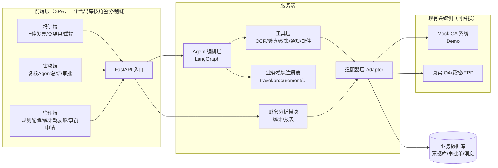
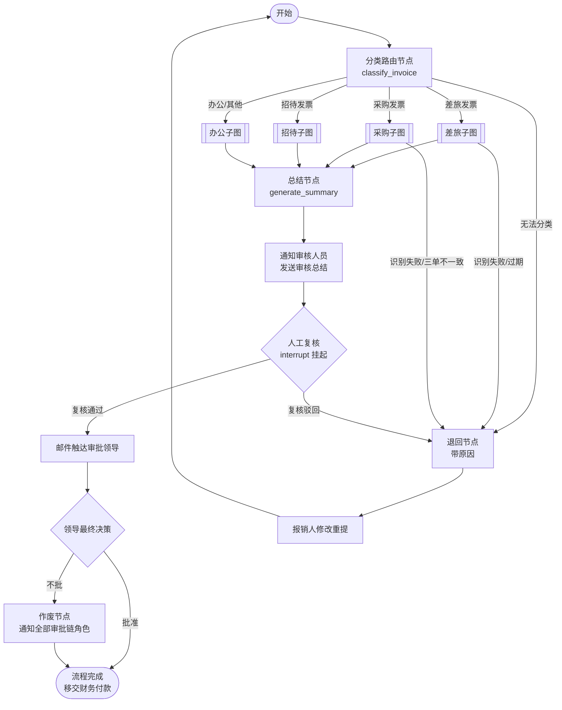

# FlowInvoice · 发票报销智能 Agent 系统

> **用 LangChain + LangGraph 多 Agent 编排，把企业发票报销的「识别 → 验真 → 归类 → 合规 → 审批链 → 审核总结 → 通知触达」全流程自动化。**
> 沉淀审批执行数据，支撑财务统计与管理层驾驶舱；通过标准适配器接口，可复用于任意现有报销/OA 系统。

---

## 🎯 项目定位

在现有报销系统之上构建一个 **AI 智能审核层**：员工上传发票，多 Agent 自动完成识别、验真、业务分类、政策合规、审批链生成与审核总结；**人工只保留「最终决策」**——审核人员复核、领导审批。

```
员工上传发票 → [Agent 自动审核] → 审核人员复核 → 领导审批 → 结果回写现有系统
                    ↑
   识别 / 验真 / 分类 / 合规 / 审批链 / 总结
   （脏活累活全自动，人只做判断）
```

---

## ✨ 核心特性

| 特性 | 说明 |
|------|------|
| **多业务多图** | 发票先分类，不同业务（差旅/采购/招待/办公）走独立 LangGraph 子图，规则互不干扰 |
| **Human-in-the-Loop** | 关键决策点用 LangGraph `interrupt` 挂起，人工复核后恢复 |
| **退回 / 作废双闭环** | 可修复问题带原因退回重提；最终否决整单作废并通知全部审批链角色 |
| **事前申请匹配** | 先申请后报销：申请单带**有效期**，报销时校验方向/金额/过期时间 |
| **管理驾驶舱** | 多角色视图（个人/审批人/财务/总经理），审批漏斗、整体规模、异常预警 |
| **适配器可复用** | 对接现有系统的接口全部抽象，Mock 可跑通 Demo，真实部署即插即用 |
| **插件式业务扩展** | 新增业务 = 新建模块 + 注册表注册，主框架零改动 |
| **前端三端** | 报销端 / 审核端 / 管理端（一个 SPA，按角色分视图） |

---

## 🏗 系统架构



### Agent 编排（LangGraph 总控图）



---

## 📁 目录结构

```
flowinvoice/
├── docs/                     # 设计文档（架构 / 业务流程 / 代码规范）
├── app/                      # 后端（Python）
│   ├── api/                  # 接入层：路由 / DTO / 鉴权
│   ├── graphs/               # 编排层：LangGraph
│   │   ├── router_graph.py   # 总控图
│   │   ├── base_subgraph.py  # 子图模板
│   │   └── businesses/       # 业务模块（插件，注册表装配）
│   ├── shared/               # 共享业务模块（事前申请 / 政策 / 统计）
│   ├── tools/                # Agent 工具（OCR/验真/通知/邮件）
│   ├── adapters/             # 外部系统接口（依赖倒置，Mock 可跑）
│   ├── core/                 # 通用基础（config/state/uploader）
│   ├── registry.py           # 业务模块注册表
│   └── policy/               # 政策规则配置（YAML）
├── frontend/                 # 前端 SPA（报销端/审核端/管理端）
└── tests/
```

---

## 🛠 技术栈

| 领域 | 选型 |
|------|------|
| 编排 | **LangGraph**（Python）：状态机 / 子图 / `interrupt`（HITL） |
| LLM 框架 | LangChain：工具调用、Prompt 管理 |
| LLM | GPT-4o / Claude / Qwen（可配置） |
| OCR | PaddleOCR / 云 OCR / 多模态 LLM（可插拔） |
| API | FastAPI + Pydantic |
| 存储 | SQLite（Demo）→ PostgreSQL（生产） |
| 前端 | React + TypeScript + Vite + Ant Design |
| 打包 | Docker + docker-compose |

---

## 🚀 快速开始

> 📌 **当前阶段：文档设计完成，代码实现进行中（第一个业务闭环：差旅）。**

```
# 1. 克隆仓库
git clone <repo-url>
cd flowinvoice

# 2. 后端（文档完成后更新）
python -m venv .venv && source .venv/bin/activate
pip install -r requirements.txt
uvicorn app.main:app --reload

# 3. 前端（二期）
cd frontend && npm install && npm run dev
```

---

## 📖 设计文档

| 文档 | 内容 |
|------|------|
| [`docs/01-项目整体架构.md`](docs/01-项目整体架构.md) | 分层架构、LangGraph 图设计、模块化、适配器、落地路线 |
| [`docs/02-报销场景与业务流程.md`](docs/02-报销场景与业务流程.md) | 六步流程、审批≠支付边界、四大场景、控制点、事前申请、统计视图 |
| [`docs/03-代码规范.md`](docs/03-代码规范.md) | 分层/复用/注释/扩展规范，每行代码「作用 + 业务用途」 |

---

## 🧠 设计亮点（面试向）

1. **为什么多图而不是单图**：差旅查日期、采购验三单匹配、招待查事前申请——规则天然隔离，独立演进，符合企业分制度管理现实。
2. **为什么工具而非纯 LLM 判断**：验真/查重/审批链是确定性操作，LLM 只做分类/抽取/总结等「理解类」工作，杜绝幻觉，落地可信。
3. **业务异常闭环**：退回带结构化原因 + 可重提；最终否决整单作废 + 全员通知。框架承载真实业务的异常复杂度。
4. **多层设计的双重价值**：审批执行记录沉淀数据 → 支撑管理层驾驶舱（审批漏斗/成功率/异常预警），自动化之外兼治理把控。
5. **适配器依赖倒置**：AI 服务与业务系统解耦，才能真正「打包复用到现有系统」。

---

## 🗺 Roadmap

- [x] 架构 / 业务流程 / 代码规范文档
- [ ] **差旅业务最小闭环**（上传 → Agent 审核 → 人工复核 → 邮件 → 通过/退回/作废）
- [ ] 办公 / 招待业务（插件式扩展）
- [ ] 采购业务（联合审批 + 三单匹配 + 专票抵扣）
- [ ] 前端三端（报销端 / 审核端 / 管理端）
- [ ] 统计驾驶舱 + 管理报表

---

## 📄 License

MIT
