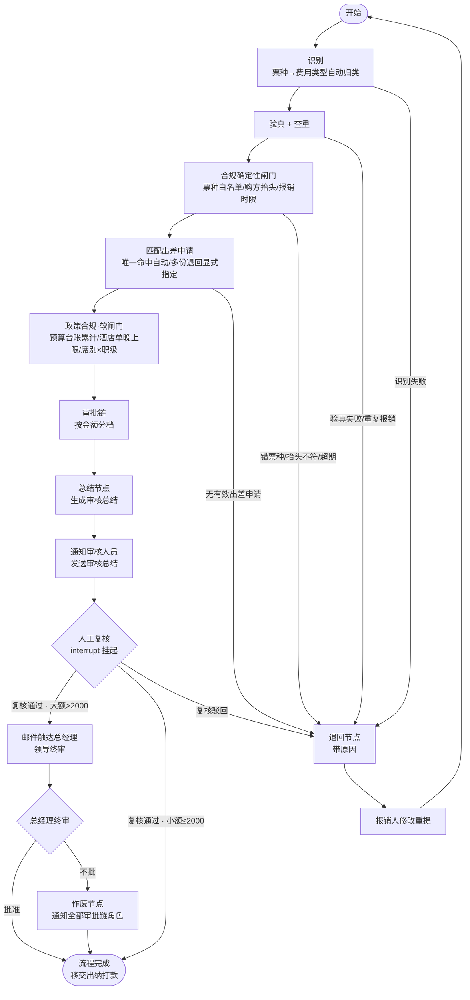

# FlowInvoice · 发票报销智能 Agent 系统

> **用 LangChain + LangGraph 多 Agent 编排，把企业发票报销的「识别 → 验真 → 归类 → 合规 → 审批链 → 审核总结 → 通知触达」全流程自动化。**
> 沉淀审批执行数据，支撑财务统计与管理层驾驶舱；通过标准适配器接口，可复用于任意现有报销/OA 系统。

---

## 🎯 项目定位

在现有报销系统之上构建一个 **AI 智能审核层**：员工上传发票，多 Agent 自动完成识别、验真、业务分类、政策合规、审批链生成与审核总结；**人工只保留「最终决策」**——审核人员复核、领导审批（大额）、出纳打款。

```
员工上传发票 → [Agent 自动审核] → 审核人员复核 → 领导审批(大额) → 出纳打款 → 到账通知
                    ↑
   识别 / 验真 / 分类 / 合规 / 审批链 / 总结
   （脏活累活全自动，人只做判断；审批≠支付，钱只由出纳碰）
```

---

## ✨ 核心特性

| 特性 | 说明 |
|------|------|
| **费用类型驱动的个人报销闭环** | 个人垫付报销统一走一套 Agent 闭环；票据由系统识别为**费用类型**（火车票→差旅交通/打车→市内交通…），政策/事前申请/合规按类型配置，规则互不干扰 |
| **Human-in-the-Loop** | 关键决策点用 LangGraph `interrupt` 挂起，人工复核后恢复 |
| **退回 / 作废双闭环** | 可修复问题带原因退回重提；最终否决整单作废并通知全部审批链角色 |
| **审批链按金额分档** | 制度 YAML 驱动：小额(≤2000)直属上级单级审批、总经理仅被告知；大额(>2000)需总经理终审 |
| **审批≠支付** | 审批链角色只批准不碰钱；打款是财务域动作，仅出纳执行（approved → paid + 到账通知） |
| **工具调用 + 规则兜底** | 验真/审批链/查重等确定性操作走规则与工具，LLM 只做分类/抽取/总结等理解类工作，杜绝幻觉（LLM 不碰钱的真伪） |
| **状态机审计留痕** | 全局状态机（in_review → approved/returned/voided）+ 各级决策执行记录落库，支撑管理驾驶舱与审计追溯 |
| **事前申请匹配** | 先申请后报销：申请单带**有效期**，报销时按费用类型组校验区间/金额/过期时间（预算台账逐笔占用） |
| **管理驾驶舱** | 多角色视图（个人/审批人/财务/总经理），审批漏斗、整体规模、异常预警 |
| **适配器可复用** | 对接现有系统的接口全部抽象，Mock 可跑通 Demo，真实部署即插即用 |
| **费用类型组扩展** | 场景开放分不完——新增费用类型组（办公/招待…）= 新建模块 + 注册 + 政策 YAML，复用同一报销闭环；采购/对公为独立对公付款通道（规划中） |
| **前端多端** | 报销端 / 审核端 / 出纳端（一个 SPA，按角色分视图） |

---

## 🏗 系统架构


### Agent 编排（LangGraph 总控图 · 个人报销单闭环）

> 个人报销是**单一闭环**（本期实例化差旅费用组）；不按 差旅/采购/招待/办公 并列切分子图——场景差异由费用类型承载，采购/对公付款另立独立通道。



---

## 📁 目录结构

```
flowinvoice/
├── docs/                     # 设计文档（架构 / 业务流程 / 代码规范）
├── app/                      # 后端（Python）
│   ├── api/                  # 接入层：路由 / DTO / 鉴权
│   ├── graphs/               # 编排层：LangGraph
│   │   ├── router_graph.py   # 总控图
│   │   ├── base_subgraph.py  # 子图模板
│   │   └── businesses/       # 费用类型组模块（travel=差旅，插件装配）
│   ├── shared/               # 共享业务模块（事前申请 / 政策 / 统计）
│   ├── tools/                # Agent 工具（OCR/验真/通知/邮件）
│   ├── adapters/             # 外部系统接口（依赖倒置，Mock 可跑）
│   ├── core/                 # 通用基础（config/state/uploader）
│   ├── registry.py           # 费用类型组模块注册表
│   └── policy/               # 政策规则配置（YAML）
└── frontend/                 # 前端 SPA（报销端/审核端/管理端）
```

---

## 🛠 技术栈

| 领域 | 选型 |
|------|------|
| 编排 | **LangGraph**（Python）：状态机 / 子图 / `interrupt`（HITL） |
| LLM 框架 | LangChain：工具调用、Prompt 管理 |
| LLM | DeepSeek（OpenAI 兼容，可配置；无 key 自动降级规则路径） |
| OCR | 数电票XML解析（L1）/ 文本模板库（L4）已实现；PaddleOCR / 多模态 LLM 规划中（分层可插拔，见 docs/04） |
| API | FastAPI + Pydantic |
| 存储 | PostgreSQL（生产，PgStorage）+ SQLite（测试替身）；pgvector 混合检索 |
| 对象存储 | MinIO / S3 兼容（发票源文件，DB 只存 file_key；未配置走本地目录替身） |
| 异步任务 | Celery + Redis（异步提交进 worker，broker 不可达自动降级同步；#53 接前端轮询） |
| 日志 | 结构化 JSON 日志（request_id/invoice_no 关联 + DSN 脱敏 + 按日轮转） |
| 前端 | React + TypeScript + Vite + Ant Design |
| 打包 | Docker + docker-compose（#54 编排） |

---

## 🚀 快速开始（已可跑通）

> 个人报销闭环（差旅费用组）已可用：上传票据（系统自动识别费用类型）→ Agent 自动审核 → 人工复核 →（大额）领导终审 → 出纳打款 → 批准/退回/作废。

### 环境要求

| 依赖 | 版本 | 用途 |
|------|------|------|
| Python | 3.12+（建议 conda/venv 虚拟环境） | 后端 |
| Node.js | 18+（自带 npm） | 前端 |

### 1. 启动后端（FastAPI · 端口 8000）

```bash
# 首次安装依赖
pip install -r requirements.txt

# 启动服务（--reload 改代码自动重载）
uvicorn app.main:app --reload --port 8000
```

- 验证：浏览器打开 <http://127.0.0.1:8000/docs>，可看到**带中文说明**的 Swagger 接口文档。
- 启动时自动种入演示数据（事前申请、Mock 人员、政策规则），无需初始化数据库。
- 端口被占用时：`netstat -ano | findstr :8000` 找到 PID 后 `taskkill /F /PID <PID>` 再重启。

### 2. 启动前端（React SPA · 端口 5173）

```bash
cd frontend
npm install      # 首次安装依赖
npm run dev      # 启动开发服务器
```

- 打开 **<http://localhost:5173>**（注意用 `localhost` 而非 `127.0.0.1`，vite 绑定 IPv6 回环）。
- 前端会把 `/api` 请求自动代理到 `http://127.0.0.1:8000`，所以**必须先启动后端**再开前端。
- 生产构建（可选）：`npm run build`，产物在 `frontend/dist/`。

### 3. 体验 5 分钟 Demo

| 步骤 | 操作 |
|------|------|
| ① 上传发票 | 「提交报销」页上传 `demo/样例-火车票.txt`，点「提交报销，交给 Agent 审核」 |
| ② 人工复核 | 顶栏切到「李四 · 审核人(2001)」→「审批中心」→ 查看详情 → 批准（小额 ≤2000 直接批准 → 「已批准」，总经理仅收到**小额告知**，不占审批资源） |
| ③ 出纳打款 | 顶栏切到「赵六 · 出纳(3001)」→「出纳端」→ 待打款 → 查看 → 确认打款 → 状态变为「已打款」，报销人收到到账通知 |
| ④ 大额体验（可选） | 把 `demo/样例-火车票.txt` 里的金额改成 ≥2000 再提交，可见**两级审批链**：2001 批准后挂起，需切到「孙七 · 总经理(4001)」终审 |
| ⑤ 查看留痕 | 「我的报销」中查看 Agent 总结、政策依据（RAG 命中条款）、合规检查、审批记录（含出纳打款）、通知/邮件留痕 |

> **角色即登录态**：Demo 无登录/SSO，用顶栏角色下拉模拟员工视角；后端按「角色 × 步骤」做权限校验，越权操作会被 403/400 拦截。

### 4. 其他启动方式（PyCharm）

仓库自带共享运行配置（`.idea/runConfigurations/`），直接用 PyCharm 打开后一键运行：

| 配置 | 作用 |
|------|------|
| `FlowInvoice_server` | 以模块方式运行 uvicorn（等同第 1 步，需先切换到 `FlowInvoice` 解释器） |
| `FlowInvoice_worker (async)` | 以模块方式运行 Celery worker（`-P solo`）——见下方「运行异步模式」。Windows 下 Celery 不支持 `-B` 内嵌 beat，周期回收需另跑 beat（`scripts/dev_async.ps1` 一并拉起） |

### 5. 运行异步模式（可选 · Celery worker + beat 周期自愈）

默认同步直跑（提交即返回完整结果）。想体验**真实异步**（提交即 202 受理 → worker 后台处理 → 前端轮询进度），三步：

1. **开开关 + 起 Redis**：`.env` 设 `FLOWINVOICE_ASYNC=1`；`docker compose up -d redis`（broker，compose 见 docker-compose.yml）。
2. **起 worker + beat**（任一方式）：
   - 终端脚本：`scripts/dev_async.ps1`（Windows）/ `scripts/dev_async.sh`（Linux/macOS）——一键同时拉起 worker + beat（Windows 下 Celery 不支持 `-B` 内嵌，脚本把 beat 作为独立进程起，效果一致）；POSIX 亦可 `dev_async.sh` 内嵌；
   - 或 PyCharm 直接跑共享配置 `FlowInvoice_worker (async)`（仅 worker），另开终端跑 `python -m celery -A app.celery_app beat`；
   - 或分两个终端：`python -m celery -A app.celery_app worker -P solo --loglevel=INFO` 与 `python -m celery -A app.celery_app beat`。
3. **提交体验**：与同步完全相同，提交页返回「已受理 + 单号」进度动画，worker 处理完自动出结果。

> **为什么需要 beat（周期回收）**：worker 是独立进程，崩溃后 `processing` 的任务不会自己续上。API 启动时会复位一次粘滞任务，但运行期要靠 beat 周期任务兜底——`reclaim-stuck` 每 60s 扫描，把超过 `STUCK_AFTER_SECONDS`（默认 300s）仍 `processing` 的任务复位为 `pending` 并重新投递（worker 重跑），实现**运行期自愈**。
>
> **失败重试闭环**：任务重试耗尽进入 `failed`（附原因）后，报销端「我的报销 → 处理失败的任务」可一键**重试**（`POST /api/submissions/{id}/retry` 重新投递，失败单才可见、才可重试）。
>
> **broker 宕机不瘫痪**：worker/Redis 缺失或不可达时，API 自动降级同步直跑并把任务行对齐真实结果——外部依赖故障不影响核心报销可用（与 `-P solo`、启动 reset_stuck 一起构成 dev 环境「零运维」体验）。

---

## 📖 设计文档

| 文档 | 内容 |
|------|------|
| [`docs/01-项目整体架构.md`](docs/01-项目整体架构.md) | 纯架构：分层、LangGraph 图设计、模块化、适配器、工具层、技术栈、前端 |
| [`docs/02-报销场景与业务流程.md`](docs/02-报销场景与业务流程.md) | 六步流程、审批≠支付边界、四大场景、控制点、事前申请、统计视图 |
| [`docs/03-报销制度研究与RAG设计.md`](docs/03-报销制度研究与RAG设计.md) | 制度条款语料 + BM25/向量 RAG 混合检索设计 |
| [`docs/04-发票识别与验真设计.md`](docs/04-发票识别与验真设计.md) | 发票形态分层识别 + 税局查验/电子签名验真（权威真实性，非 LLM） |
| [`docs/AGENTS.md`](docs/AGENTS.md) | 代码规范：分层/复用/注释/扩展规范 + 代码简洁硬性规则，每行代码「作用 + 业务用途」 |

---

## 🧠 设计亮点（面试向）

1. **单通道 + 费用类型，而不是 N 个「业务方向」**：个人垫付报销统一走一套 Agent 闭环，差旅/办公/打车等只是**费用类型**（票据自动归类、按类型配政策）——场景是开放的、分不完的，不该成为系统分支；真正有结构差异的是结算通道（个人报销 vs 对公付款）。
2. **为什么工具而非纯 LLM 判断**：验真/查重/审批链是确定性操作，LLM 只做分类/抽取/总结等「理解类」工作，杜绝幻觉，落地可信。
3. **业务异常闭环**：退回带结构化原因 + 可重提；最终否决整单作废 + 全员通知。框架承载真实业务的异常复杂度。
4. **LangGraph 状态机 vs 线性 Chain**：条件分支 + `interrupt` HITL 把「复核-终审-退回-作废」画成图而非写死的线性流程——这就是面试必考的「为什么用图而不是 Chain」。
5. **Agent 与 Workflow 的边界**：主干是受约束 Workflow（可审计、可控），LLM 只在理解类决策点（分类/抽取/总结/合规）介入——「不为用 Agent 而 Agent」的工程判断。
6. **多层设计的双重价值**：审批执行记录沉淀数据 → 支撑管理层驾驶舱（审批漏斗/成功率/异常预警），自动化之外兼治理把控。
7. **适配器依赖倒置**：AI 服务与业务系统解耦，才能真正「打包复用到现有系统」。

---

## 🗺 Roadmap

- [x] 架构 / 业务流程 / 代码规范文档
- [x] **差旅业务最小闭环**（上传 → Agent 审核 → 人工复核 → 邮件 → 通过/退回/作废）
- [x] **审批≠支付 + 出纳打款**（approved → 出纳确认打款 → paid + 到账通知）
- [x] **审批链按金额分档**（小额免总经理审批，仅告知；大额需总经理终审）
- [x] **一单多票批量报销 + 部分接受**（≤10 张并入一单，票面合计=报销总额；坏/假/重复/超期票拒收不拖累好票，原因结构化供重传）
- [ ] 办公 / 招待等费用类型组扩展（复用个人报销闭环：票种归类 + 政策 YAML 数据接入）
- [ ] 对公付款通道（采购：PO / 三单匹配 + 会签 + 专票抵扣，独立流程）
- [x] 前端多端（报销端 / 审核端 / 出纳端，一个 React SPA 按角色分视图）
- [ ] 统计驾驶舱 + 管理报表

### 迭代待办（当前阶段任务清单 · 2026-09-04 更新）

> 状态来源：项目任务跟踪（`/todos` 会话任务表）。⛓ = 依赖前置。

**本阶段已交付 ✅**

- [x] **#26 docs/06 数据模型定稿**（生产级 PG 表结构 + 记忆 + 异步任务层）
- [x] **#30/#50 [P1] PgStorage 生产实现 + 拆表 + 发票池查重 + Decimal**（连本机 PG；`invoices`/`approval_records` 拆表；部分唯一索引真查重；存储边界 Decimal）
- [x] **#31/#45-49 LLM 接入**（recognize/summarize/classify/compliance 四处接线 + 无 key 降级规则路径）
- [x] **#33/#35-38 政策 RAG 优化**（bge-m3 向量存 pgvector + BM25/向量混合检索 + RRF + 降级）
- [x] **#39-43 审查修复 4 轮**（接线层 / 检索层 / 业务层 / 配置测试）
- [x] **#51 [P2] ObjectStorage 抽象 + MinIO**（源文件进对象存储，DB 只存 file_key）
- [x] **#56-60 企业级日志框架 + 第 4 轮阶段总审修复**（结构化/关联/轮转；F1/F2/F3 + P8 发票池真查重接线）
- [x] **#52 [P3] Celery + Redis 异步任务接线**（提交→处理→挂起 进 worker，API 即回 202；持久化 checkpointer 三态，跨进程 HITL 恢复实测通过；broker 不可达降级同步；重启恢复粘滞任务）
- [x] **#64 [P3] 事前申请核销接线 + 预算校验**（初版按布尔"一次性核销"模型接线；**#91 模型审计发现与台账语义冲突，已改逐笔台账占用**——见下 #91）
- [x] **#65 [P3] 上传安全防护**（扩展名白名单 + 大小上限分块中止 + UploadValidationError→400；防任意文件打满磁盘）
- [x] **#66 [P3] paused 推导修复 + decide 幂等加固**（paused 由 process_status+current_step 推导，GET 详情不再恒 False；_authorize 移入锁内，消除并发双击 TOCTOU）
- [x] **#67 [P3] 提交异常发票池泄漏清理**（图执行异常 → 释放票号占用，防误判重复；幂等 no-op）
- [x] **#68 [P3] 上传临时文件生命周期清理**（启动 sweep 过期处理缓存，防 data/uploads 无限增长）
- [x] **#69 [P3] 金额/日期非法输入校验**（票面金额≤0 / 申报负数 → invalid_amount；未来开票日期 → invalid_date，结构化退回）
- [x] **#70 [P3] 列表按员工/审批角色隔离**（`employee_id`=我的单据、`approver_id`=我的待办；review=链首 / leader_decision=链尾）
- [x] **识别闭环：5 层管线 + 全量票面落库**（docs/04 §3）——形态全吃：数电票 XML(L1) / OFD(L2) / PDF(L3) / 文本(L4) / 图片·扫描 OCR(L5，真实 PaddleOCR 冒烟通过)；契约分核心必抽 + 扩展尽力 + source 标注；`invoices` 全量 11 列 + `invoice_items` 明细子表（一对多），SQLite/PG 双实现同事务落库；前端 accept 收 OFD。**真实冒烟修 3 坑**：Paddle 3.3 关 MKLDNN（oneDNN/PIR 崩溃）、PaddleX 3.x `{"res":...}` 包装解包、`rec_boxes` 扁平格式兼容
- [x] **#85-89 火车票专项闭环（一个业务做完整闭环，扩展只需加函数/对象/DB）**：
  - **#85/#88 高铁席别×职级合规**——`employees` 加 `grade`（普通员工/经理/总监/高管），`travel.yaml` 分档（≤二等座/≤二等座/≤一等座/商务座）；越级乘席 → **软闸门**标记 + 复核人特批须填意见留痕（无批注拒批，硬/软闸门衔接）
  - **#86 火车票识别真实化**——铁路电子客票 XML 按 **GB/T 44554.6 camelCase** 专用分支解析（`_parse_rail`）；文本报销凭证按乘车要素识别，缺省 `invoice_type=火车票` / `title=发站-到站`；乘车字段（车次/发到站/席别/座位号/乘车人/电子客票号）结构化供席别合规消费；demo 样张换真实票样
  - **#87 发票合规确定性闸门**（`check_invoice_compliance`，插在 verify 之后、事前申请匹配**之前**）——票种白名单 / 购方抬头（有购方且非本公司才拒，实名票据无购方不误伤）/ **报销时限 180 天**（超期硬闸门退回；即原 #63 目标，落点更优：先于业务匹配避免归因错乱）；任一不满足直接结构化退回，不进人工复核
  - **#89 退回重提留痕**——重提关联原单号 `parent_request_id`（仅可关联已退回/作废原单，否则 400），API 详情可追溯原单；同票号退回后可重提不再误判重复
  - **回归锁死**：`tests/test_train_ticket.py` 12 例（全量 144 passed / 8 skipped）
- [x] **#91 [P3] 事前申请核销改预算台账模型（F-A 审计修复 · 一次出差多张票）**——删布尔 `mark_used` 一次性核销（Bug 39）：核销 = approved/paid 终态按票面金额记一笔占用（`advance_reservations` 台账，request_id 唯一幂等、approve+paid 双入口不重复累计）；申请状态**不翻 used**、active 持续供本趟多张票共享匹配；超预算软闸门改**累计口径**（已占用 + 本票 > 预估 → 复核人批注特批）；`match` 返回附 `reserved_amount`（提交时点占用快照）。多票共享 / 累计超支特批 / 退回不占用专项测试 `tests/test_advance_pool.py`（3 例）+ `test_api.py`（3 例）——**全量 149 passed / 8 skipped**

- [x] **#95-110 报销体验收敛 + 直接报销模式**——报销页可选关联出差申请（自动/指定，下拉带剩余额度）；**直接报销**（未做事前申请）由"必经项"改成可选项（默认关联、可切直接，UI 与后端口径一致，Bug 40）；多重叠申请自动匹配歧义防护（不静默取最早 #97）
- [x] **#114/#116/#117/#118/#119-124 收口批：真异步前端 + 审批端 + HITL 实时态 + 一单多票（2026-09-04）**：
  - **#53 [P4] 异步前端接线 + 失败重试 + 审核端解耦 完成**——202 提交 → 进度动画轮询 → succeeded 出结果；failed 报销端可见、一键重试（`POST /api/submissions/{id}/retry`）；三端列表改服务端 `employee_id`/`approver_id` 过滤（删客户端过滤）
  - **#116 [C] 异步运维落地**——`scripts/dev_async.ps1`/`.sh` 一键起 worker+beat、PyCharm worker 共享配置；beat 每 60s 触发 `reclaim_stuck` 周期回收卡死任务（运行期自愈）；Bug 43：Windows 不支持 Celery `-B` → beat 独立进程
  - **#118 [B] HITL 实时态鉴权**——decide/pay/路由/软闸门改读实时 checkpoint（`_live_state`，行=展示缓存）；resume 幂等闸 + 启动孤儿 checkpoint 物化对账
  - **#119-124 [A] 一单多票批处理 + 部分接受**——`files[]` 1..10 张并入一单；单票重活单元（识别→确定性硬闸门→验真→发票池入池）共享线程池并行 ≤10；硬闸门先于入池（坏/假/重复/超期**不占池**）；`accepted[]`/`rejected[]` 部分接受（坏票拒收不拖累好票、原因结构化供重传）；事前申请关联 / 合规 / 审批链 / 预算占用全按 **Σ(accepted 票面)** 收敛；单票路径 = 批大小 1，删旧单票专用实现；前端多选上传（≤10）+ 票据明细表 + 票面合计 + 被拒列表
  - **回归锁死**：新增 `tests/test_multi_ticket.py` / `test_hitl_live_state.py` 等；**全量 173 passed / 8 skipped**；live 真异步 E2E（PG + Redis + 真 worker，3 票含坏票）202→tickets=2/rejected=1→approve→pay→预算占 Σ400→重复票被发票池拦，全链路通过
- [x] **2026-09-04 纯代码 todo 五项收口（#27/#28/#44/#62/#32；真环境项 #54/#55 跳过）**：
  - **#27 去硬编码**——员工/审批角色迁到 `app/adapters/org_data.yaml`，seed 进 `employees`/`approver_roles` 表（#28 拆表后）；`MockUserProvider` 构造时入库再加载，`get_employee/manager/approver` 语义不变；删模块级 `DIRECTORY`/`ROLE_MAP`
  - **#44 金额 Decimal 全量重构**——载具（JSON/存储/API）保持 float，**一切金额计算/比较**经 `app/core/money.to_money()`（Decimal(str(float))）收敛：批量 Σ、酒店单晚限额、预算池、审批链阈值、汇总 f-string 全改 Decimal 运算；已实测 langgraph `JsonPlusSerializer` 支持 Decimal checkpoint 往返（剩项：advance 台账 SQLite REAL 的 SUM 返回 float，比较前再归一化）
  - **#28 短期记忆持久化全量落地**——`build_checkpointer` 统一持久化（同步不再 MemorySaver）：PG→PostgresSaver、SQLite→SqliteSaver（同目录 checkpoints.sqlite）；启动/周期孤儿 checkpoint 物化两模式一致执行（清同步幽灵单据隐患）；MemorySaver 仅兜底直接 new Container 的测试直构
  - **#62 审批 SLA**——挂起即 `_stamp_pause` 记 `paused_at`（**每级审批重新计时**，不用会随催办刷新的 updated_at 做锚）；时限在 `travel.yaml`（`approval_sla_hours`=24 / `approval_escalate_hours`=72，0=关）；beat 每 60s `flowinvoice.sla_sweep` 扫挂起单：超时催办当前审批人（站内消息留痕）、仍超时升级监督角色（单级/终级→财务）；**审批权不自动移交**（升级=监督通知防越权）；SLA 标记 CAS 写回防覆盖 decide 推进中的新行
  - **#32 Function Calling 实战**——`summarize` 节点真正 `bind_tools`：LLM 自主选**只读工具** `search_policy`（制度条款检索）/ `lookup_employee`（组织档案）→ 工具真执行 → 结果 tool 角色回填 → 产出总结；工具轨迹 `research_notes` 回填状态并在详情暴露（审核可追溯）；**验真/审批/钱不进工具白名单**（LLM 只做理解不做判定）；无 key / 多票批回落既有确定性模板；回合上限 4 防死循环烧钱
  - **验证**：新增 `tests/test_sla_sweep.py`(4) / `test_function_calling.py`(9)；**全量 186 passed / 8 skipped**，前端无改动（详情仅新增 `research_notes` 只读字段）
- [x] **2026-09-04 审查遗留收口批：对象存储取用 + 崩溃窗口语义 + expired 读派生（#93/#94/#104 + F-4 · docs/14 第6轮遗留清零，个人差旅报销闭环达成 🎯）**：
  - **#93 [F-D] 对象存储取用接线**——OCR 源读取降级（`_source_bytes`：本地临时 `file_path` 失效/被清理 → 按 `object_key` 取对象存储权威副本；两处皆缺 → `ocr_failed` 结构化退回，不裸 500）；新增 `GET /api/requests/{id}/originals/{object_key}` **原件下载/预览端点**（只放行本单 `tickets`/`rejected` 内的 object_key，伪造/跨单 → 404；媒体类型按扩展名内联预览，中文原文件名 RFC 5987 透传）；`request_view` 去泄漏——`tickets`/`rejected` 摘掉本地 `file_path`、只留 `object_key`（视图浅拷贝，不动权威落库 state）；前端票据明细表 / 被拒列表 / 单票视图各加「查看原件 ↗」新标签预览（被拒票同样可核看，重传依据不只文字）
  - **#94 [F-E] 崩溃窗口语义收口**——核心判定 `submit_outcome_materialized`：requests 行已写且停在 HITL 挂起/终态 ⇒ 首轮已完整跑完、只差 `succeeded` 未落（写前崩溃）→ **补 succeeded、绝不重跑**（重跑 = 重发审核通知 + 发票重入池假查重覆盖已审单据）；行缺失/停在在途 = 真中途崩溃 → `release_invoice` 清首轮残留入池票（防重跑假查重）+ requeue 重新投递重跑；`recover_stuck_submissions` **同时扫 processing + pending**（收口盲 reset 制造的永久 pending 僵尸；投递丢失/复位后未投同理），beat 周期 + 启动 force 双入口复用；worker 领单后同判定兜底
  - **#104 [P-3] expired 读路径派生**——DB 恒存 `active`（匹配有效性本就靠查询日期门实时判定），`list_advances` 改 Python 层按 `valid_until < today` **实时派生** expired 再过滤（无物理写、无后台清扫、无双实现状态源）；`AdvanceDetail.status` 口径与 docstring 同步（active=有效 / expired=按有效期实时派生）
  - **F-4**：`AdvanceMissingError` docstring 文案修正（删旧 used 模型残留描述）
  - **回归锁死**：新增 `tests/test_object_storage_consumption.py`(7) + 异步崩溃恢复 3 例 + advance 过期派生 1 例；**全量 197 passed / 8 skipped**，前端 `npm run build` 绿

**待办（按依赖顺序）⬜**

- [ ] **#54 [部署] docker-compose 生产编排 + 端到端验证**（api+worker+postgres+redis+minio 全栈编排 + 端到端验证；现 compose 仅 postgres+redis 开发态）
- [ ] **#55 生产税务查验 TaxVerifyProvider 实现**（⛓ #54；替换 Mock 验真）

---

## 📄 License

MIT
