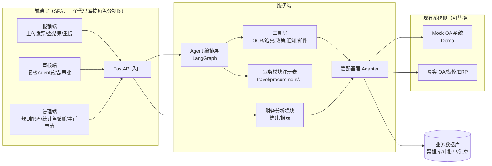
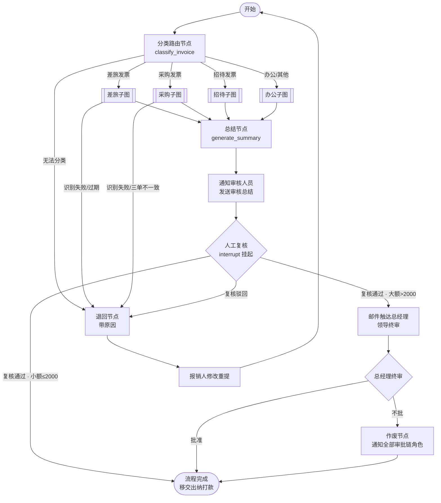

# FlowInvoice · 发票报销智能 Agent 系统

> **用 LangChain + LangGraph 多 Agent 编排，把企业发票报销的「识别 → 验真 → 归类 → 合规 → 审批链 → 审核总结 → 通知触达」全流程自动化。**
> 沉淀审批执行数据，支撑财务统计与管理层驾驶舱；通过标准适配器接口，可复用于任意现有报销/OA 系统。

---

## 🎯 项目定位

在现有报销系统之上构建一个 **AI 智能审核层**：员工上传发票，多 Agent 自动完成识别、验真、业务分类、政策合规、审批链生成与审核总结；**人工只保留「最终决策」**——审核人员复核、领导审批（大额）、出纳打款。

```
员工上传发票 → [Agent 自动审核] → 审核人员复核 → 领导审批(大额) → 出纳打款 → 到账通知
                    ↑
   识别 / 验真 / 分类 / 合规 / 审批链 / 总结
   （脏活累活全自动，人只做判断；审批≠支付，钱只由出纳碰）
```

---

## ✨ 核心特性

| 特性 | 说明 |
|------|------|
| **多业务多图** | 发票先分类，不同业务（差旅/采购/招待/办公）走独立 LangGraph 子图，规则互不干扰 |
| **Human-in-the-Loop** | 关键决策点用 LangGraph `interrupt` 挂起，人工复核后恢复 |
| **退回 / 作废双闭环** | 可修复问题带原因退回重提；最终否决整单作废并通知全部审批链角色 |
| **审批链按金额分档** | 制度 YAML 驱动：小额(≤2000)直属上级单级审批、总经理仅被告知；大额(>2000)需总经理终审 |
| **审批≠支付** | 审批链角色只批准不碰钱；打款是财务域动作，仅出纳执行（approved → paid + 到账通知） |
| **工具调用 + 规则兜底** | 验真/审批链/查重等确定性操作走规则与工具，LLM 只做分类/抽取/总结等理解类工作，杜绝幻觉（LLM 不碰钱的真伪） |
| **状态机审计留痕** | 全局状态机（in_review → approved/returned/voided）+ 各级决策执行记录落库，支撑管理驾驶舱与审计追溯 |
| **事前申请匹配** | 先申请后报销：申请单带**有效期**，报销时校验方向/金额/过期时间 |
| **管理驾驶舱** | 多角色视图（个人/审批人/财务/总经理），审批漏斗、整体规模、异常预警 |
| **适配器可复用** | 对接现有系统的接口全部抽象，Mock 可跑通 Demo，真实部署即插即用 |
| **插件式业务扩展** | 新增业务 = 新建模块 + 注册表注册，主框架零改动 |
| **前端多端** | 报销端 / 审核端 / 出纳端（一个 SPA，按角色分视图） |

---

## 🏗 系统架构



### Agent 编排（LangGraph 总控图）



---

## 📁 目录结构

```
flowinvoice/
├── docs/                     # 设计文档（架构 / 业务流程 / 代码规范）
├── app/                      # 后端（Python）
│   ├── api/                  # 接入层：路由 / DTO / 鉴权
│   ├── graphs/               # 编排层：LangGraph
│   │   ├── router_graph.py   # 总控图
│   │   ├── base_subgraph.py  # 子图模板
│   │   └── businesses/       # 业务模块（插件，注册表装配）
│   ├── shared/               # 共享业务模块（事前申请 / 政策 / 统计）
│   ├── tools/                # Agent 工具（OCR/验真/通知/邮件）
│   ├── adapters/             # 外部系统接口（依赖倒置，Mock 可跑）
│   ├── core/                 # 通用基础（config/state/uploader）
│   ├── registry.py           # 业务模块注册表
│   └── policy/               # 政策规则配置（YAML）
├── frontend/                 # 前端 SPA（报销端/审核端/管理端）
└── tests/
```

---

## 🛠 技术栈

| 领域 | 选型 |
|------|------|
| 编排 | **LangGraph**（Python）：状态机 / 子图 / `interrupt`（HITL） |
| LLM 框架 | LangChain：工具调用、Prompt 管理 |
| LLM | DeepSeek（OpenAI 兼容，可配置；无 key 自动降级规则路径） |
| OCR | 数电票XML解析（L1）/ 文本模板库（L4）已实现；PaddleOCR / 多模态 LLM 规划中（分层可插拔，见 docs/04） |
| API | FastAPI + Pydantic |
| 存储 | PostgreSQL（生产，PgStorage）+ SQLite（测试替身）；pgvector 混合检索 |
| 对象存储 | MinIO / S3 兼容（发票源文件，DB 只存 file_key；未配置走本地目录替身） |
| 异步任务 | Celery + Redis（#52 待接线） |
| 日志 | 结构化 JSON 日志（request_id/invoice_no 关联 + DSN 脱敏 + 按日轮转） |
| 前端 | React + TypeScript + Vite + Ant Design |
| 打包 | Docker + docker-compose（#54 编排） |

---

## 🚀 快速开始（已可跑通）

> 差旅报销最小闭环已可用：上传发票 → Agent 自动审核 → 人工复核 →（大额）领导终审 → 出纳打款 → 批准/退回/作废。

### 环境要求

| 依赖 | 版本 | 用途 |
|------|------|------|
| Python | 3.12+（建议 conda/venv 虚拟环境） | 后端 |
| Node.js | 18+（自带 npm） | 前端 |

### 1. 启动后端（FastAPI · 端口 8000）

```bash
# 首次安装依赖
pip install -r requirements.txt

# 启动服务（--reload 改代码自动重载）
uvicorn app.main:app --reload --port 8000
```

- 验证：浏览器打开 <http://127.0.0.1:8000/docs>，可看到**带中文说明**的 Swagger 接口文档。
- 启动时自动种入演示数据（事前申请、Mock 人员、政策规则），无需初始化数据库。
- 端口被占用时：`netstat -ano | findstr :8000` 找到 PID 后 `taskkill /F /PID <PID>` 再重启。

### 2. 启动前端（React SPA · 端口 5173）

```bash
cd frontend
npm install      # 首次安装依赖
npm run dev      # 启动开发服务器
```

- 打开 **<http://localhost:5173>**（注意用 `localhost` 而非 `127.0.0.1`，vite 绑定 IPv6 回环）。
- 前端会把 `/api` 请求自动代理到 `http://127.0.0.1:8000`，所以**必须先启动后端**再开前端。
- 生产构建（可选）：`npm run build`，产物在 `frontend/dist/`。

### 3. 体验 5 分钟 Demo

| 步骤 | 操作 |
|------|------|
| ① 上传发票 | 「提交报销」页上传 `demo/样例-火车票.txt`，点「提交报销，交给 Agent 审核」 |
| ② 人工复核 | 顶栏切到「李四 · 审核人(2001)」→「审批中心」→ 查看详情 → 批准（小额 ≤2000 直接批准 → 「已批准」，总经理仅收到**小额告知**，不占审批资源） |
| ③ 出纳打款 | 顶栏切到「赵六 · 出纳(3001)」→「出纳端」→ 待打款 → 查看 → 确认打款 → 状态变为「已打款」，报销人收到到账通知 |
| ④ 大额体验（可选） | 把 `demo/样例-火车票.txt` 里的金额改成 ≥2000 再提交，可见**两级审批链**：2001 批准后挂起，需切到「孙七 · 总经理(4001)」终审 |
| ⑤ 查看留痕 | 「我的报销」中查看 Agent 总结、政策依据（RAG 命中条款）、合规检查、审批记录（含出纳打款）、通知/邮件留痕 |

> **角色即登录态**：Demo 无登录/SSO，用顶栏角色下拉模拟员工视角；后端按「角色 × 步骤」做权限校验，越权操作会被 403/400 拦截。

### 4. 运行测试

```bash
pytest                    # 全部单测 + 集成测试（含权限越权用例）
pytest tests/test_api.py  # 只跑 API 层
```

### 5. 其他启动方式（PyCharm）

仓库自带共享运行配置（`.idea/runConfigurations/`），直接用 PyCharm 打开后一键运行：

| 配置 | 作用 |
|------|------|
| `FlowInvoice_server` | 以模块方式运行 uvicorn（等同第 1 步，需先切换到 `FlowInvoice` 解释器） |
| `FlowInvoice_tests` | 运行 pytest |

---

## 📖 设计文档

| 文档 | 内容 |
|------|------|
| [`docs/01-项目整体架构.md`](docs/01-项目整体架构.md) | 纯架构：分层、LangGraph 图设计、模块化、适配器、工具层、技术栈、前端 |
| [`docs/02-报销场景与业务流程.md`](docs/02-报销场景与业务流程.md) | 六步流程、审批≠支付边界、四大场景、控制点、事前申请、统计视图 |
| [`docs/03-报销制度研究与RAG设计.md`](docs/03-报销制度研究与RAG设计.md) | 制度条款语料 + BM25/向量 RAG 混合检索设计 |
| [`docs/04-发票识别与验真设计.md`](docs/04-发票识别与验真设计.md) | 发票形态分层识别 + 税局查验/电子签名验真（权威真实性，非 LLM） |
| [`docs/05-面试架构.md`](docs/05-面试架构.md) | 面试叙事框架：项目一句话定位 + 高频考点映射 + 追问应对（独立于整体架构） |
| [`docs/06-数据模型设计.md`](docs/06-数据模型设计.md) | 生产级 PG 数据模型定稿：requests/submissions/invoices/approval_records + 发票池部分唯一索引 |
| [`docs/07-开发Bug总结.md`](docs/07-开发Bug总结.md) | 开发 Bug 复盘（现象→根因→修复→启示，面试难题素材） |
| [`docs/08~11-代码审核记录.md`](docs/08-代码审核记录.md) | 第 1~4 轮代码审核记录（阶段收口总审见 docs/11） |
| [`docs/AGENTS.md`](docs/AGENTS.md) | 代码规范：分层/复用/注释/扩展规范 + 代码简洁硬性规则，每行代码「作用 + 业务用途」 |

---

## 🧠 设计亮点（面试向）

1. **为什么多图而不是单图**：差旅查日期、采购验三单匹配、招待查事前申请——规则天然隔离，独立演进，符合企业分制度管理现实。
2. **为什么工具而非纯 LLM 判断**：验真/查重/审批链是确定性操作，LLM 只做分类/抽取/总结等「理解类」工作，杜绝幻觉，落地可信。
3. **业务异常闭环**：退回带结构化原因 + 可重提；最终否决整单作废 + 全员通知。框架承载真实业务的异常复杂度。
4. **LangGraph 状态机 vs 线性 Chain**：条件分支 + `interrupt` HITL 把「复核-终审-退回-作废」画成图而非写死的线性流程——这就是面试必考的「为什么用图而不是 Chain」。
5. **Agent 与 Workflow 的边界**：主干是受约束 Workflow（可审计、可控），LLM 只在理解类决策点（分类/抽取/总结/合规）介入——「不为用 Agent 而 Agent」的工程判断。
6. **多层设计的双重价值**：审批执行记录沉淀数据 → 支撑管理层驾驶舱（审批漏斗/成功率/异常预警），自动化之外兼治理把控。
7. **适配器依赖倒置**：AI 服务与业务系统解耦，才能真正「打包复用到现有系统」。

---

## 🗺 Roadmap

- [x] 架构 / 业务流程 / 代码规范文档
- [x] **差旅业务最小闭环**（上传 → Agent 审核 → 人工复核 → 邮件 → 通过/退回/作废）
- [x] **审批≠支付 + 出纳打款**（approved → 出纳确认打款 → paid + 到账通知）
- [x] **审批链按金额分档**（小额免总经理审批，仅告知；大额需总经理终审）
- [ ] 办公 / 招待业务（插件式扩展）
- [ ] 采购业务（联合审批 + 三单匹配 + 专票抵扣）
- [x] 前端多端（报销端 / 审核端 / 出纳端，一个 React SPA 按角色分视图）
- [ ] 统计驾驶舱 + 管理报表

### 迭代待办（当前阶段任务清单 · 2026-09-01 更新）

> 状态来源：项目任务跟踪（`/todos` 会话任务表）。⛓ = 依赖前置。

**本阶段已交付 ✅**

- [x] **#26 docs/06 数据模型定稿**（生产级 PG 表结构 + 记忆 + 异步任务层）
- [x] **#30/#50 [P1] PgStorage 生产实现 + 拆表 + 发票池查重 + Decimal**（连本机 PG；`invoices`/`approval_records` 拆表；部分唯一索引真查重；存储边界 Decimal）
- [x] **#31/#45-49 LLM 接入**（recognize/summarize/classify/compliance 四处接线 + 无 key 降级规则路径）
- [x] **#33/#35-38 政策 RAG 优化**（bge-m3 向量存 pgvector + BM25/向量混合检索 + RRF + 降级）
- [x] **#39-43 审查修复 4 轮**（接线层 / 检索层 / 业务层 / 配置测试）
- [x] **#51 [P2] ObjectStorage 抽象 + MinIO**（源文件进对象存储，DB 只存 file_key）
- [x] **#56-60 企业级日志框架 + 第 4 轮阶段总审修复**（结构化/关联/轮转；F1/F2/F3 + P8 发票池真查重接线）

**待办（按依赖顺序）⬜**

- [ ] **#52 [P3] Celery + Redis 异步任务接线** ← 下一步（submissions 表/接口已就绪，接执行层）
- [ ] **#53 [P4] 异步 API + 前端轮询 + 重试 + 审核端解耦**（⛓ #52）
- [ ] **#54 [部署] docker-compose 生产编排 + 端到端验证**（⛓ #52；api+worker+postgres+redis+minio）
- [ ] **#55 生产税务查验 TaxVerifyProvider 实现**（⛓ #54；替换 Mock 验真）
- [ ] **#62 审批 SLA：submissions.due_at + Celery beat 催办/升级**（⛓ #52；企业级审批时限兜底，防挂起无限堆积）
- [ ] **#63 发票报销时限：verify 节点超期校验 + 结构化退回**（独立；企业级业务期限，`invoice_claim_days` 政策可配）
- [ ] **#27 去硬编码**：员工/角色 YAML seed 入库（`employees`/`approver_roles` 表），删 `mock_oa.py` 的 `DIRECTORY`/`ROLE_MAP`
- [ ] **#28 短期记忆持久化**：MemorySaver → SqliteSaver（HITL 挂起后服务重启可恢复）
- [ ] **#32 Function Calling 实战**：一个节点真正 `bind_tools` 让 LLM 选工具、回填状态
- [ ] **#44 金额 Decimal 全量重构**（进度：存储边界已 Decimal；代码内 float 运算收敛待做）

---

## 📄 License

MIT
