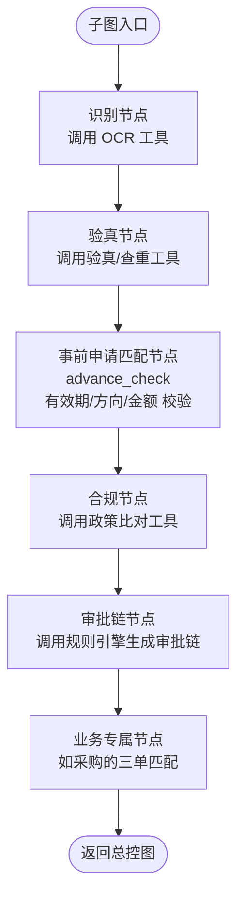
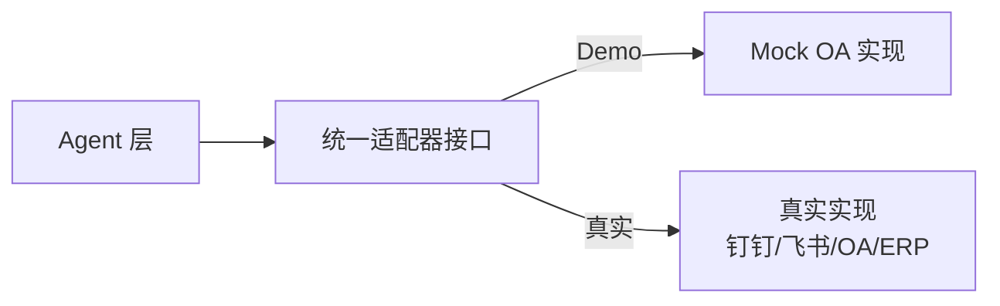

# 发票报销智能 Agent 系统 —— 项目整体架构

> 版本：v0.1 ｜ 定位：可复用于现有系统的 AI 报销 Agent 服务
> 面试方向：Agent 开发岗（LangChain / LangGraph 多 Agent 编排）

---

## 1. 项目定位

一句话描述：

> **「AI 报销 Agent 服务」：员工上传发票 → 多 Agent 自动完成 识别→验真→归类→合规→审批链生成→审核总结 → 通知审核人员复核 → 邮件触达审批领导。通过标准适配器接口，可直接复用到任意现有报销/OA 系统。**

设计目标（对应面试考察点）：

| 目标 | 说明 | 面试亮点 |
|------|------|---------|
| 多业务多图 | 发票先分类，**不同业务走不同 LangGraph 子图** | LangGraph 子图 + 动态路由 |
| 模块化/插件化 | 每个业务 = 独立模块，注册表装配，新增业务不改主框架 | 工程架构能力 |
| 可复用/可落地 | 适配器层抽象现有系统，Mock 可跑通 Demo | 系统设计 + 落地思维 |
| 人工兜底 | 关键决策点 Human-in-the-Loop（LangGraph `interrupt`） | Agent 安全与可控 |

### 1.1 系统全景（主线 + 支线 + 属性增强）

业务看着多，但本质是**一条主线 + 两条支线 + 少量属性增强**：

**主线（核心闭环，一期全做）—— 一张发票的完整旅程：**

```
员工提交：发票 + 报销信息 + 选择业务类型 + 支付方式
  ↓
分类路由（classify）→ 业务子图（采购/差旅/招待/办公）
  ├─ 识别 → 验真/查重 → 事前申请匹配 → 合规 → 审批链生成
  ↓
审核总结 → 审核人员复核（interrupt）→ 邮件领导审批
  ├─ 通过 → 回写现有系统 + 进统计
  ├─ 退回 → 带原因通知报销人 → 修改重提
  └─ 否决 → 作废 + 通知全部审批链角色
```

**支线（支撑能力，一期全做）：**
- **事前申请单**：先申请后报销，锁方向/预算/有效期（§4.5）
- **统计驾驶舱**：多角色视图（个人/审批人/财务/总经理，§12.1）

**属性增强（低成本，本质 = 提交字段 + 条件分支 + 统计维度）：**
- **支付方式**（对公 / 个人）：提交时选择，下游仅增加对公专属校验
- **预算管控**：科目额度字段 + 占用校验 + 执行率统计
- **税控抵扣**：验真时标记可抵税额 + 统计汇总

**明确不做（一期）：** ~~借款/备用金~~（适用场景有限）

---

## 2. 核心设计原则

1. **路由与业务分离**：顶层总控图只负责「分类 + 分发 + 汇总」，具体业务逻辑全部下沉到业务子图。
2. **业务子图同构**：所有业务子图遵循统一模板（识别 → 验真 → 合规 → 审批链），但**各自的节点实现、工具、政策规则不同**，可独立测试与扩展。
3. **规则可配置**：审批链规则、费用标准、抬头黑名单等全部外部配置（`policy/` 目录），不硬编码在 Agent 里。
4. **接口标准统一**：与现有系统的交互只依赖一组适配器接口，任何系统实现接口即可接入。
5. **审核结果双通道触达**：审核总结 → 审核人员（站内信/IM）；审批请求 → 领导（邮件）。
6. **业务异常闭环**：任何拒绝/退回都必须携带「原因 + 处理建议」回传上层系统与报销人，支持修改后重新提报，而不是静默失败 —— 让框架承载真实业务的异常复杂度。

---

## 3. 系统总体架构

```mermaid
flowchart LR
    subgraph 前端层（SPA，一个代码库按角色分视图）
        W[报销端<br/>上传发票/查结果/重提]
        A[审核端<br/>复核Agent总结/审批]
        M[管理端<br/>规则配置/统计驾驶舱/事前申请]
        W --> API
        A --> API
        M --> API
    end

    subgraph 服务端
        API[FastAPI 入口]
        API --> AGENT[Agent 编排层<br/>LangGraph]
        AGENT --> TOOL[工具层<br/>OCR/验真/政策/通知/邮件]
        AGENT --> REG[业务模块注册表<br/>procurement/travel/...]
        TOOL --> ADAPT[适配器层 Adapter]
        API --> ANA[财务分析模块<br/>统计/报表]
        ANA --> ADAPT
    end

    subgraph 现有系统侧（可替换）
        ADAPT --> MOCK[Mock OA 系统<br/>Demo]
        ADAPT --> REAL[真实 OA/费控/ERP]
    end

    ADAPT --> DB[(业务数据库<br/>票据库/审批单/消息)]
```

**分层职责：**

| 层 | 组件 | 职责 |
|----|------|------|
| 前端层 | SPA（报销端/审核端/管理端） | 上传入口、复核审批交互、规则配置、统计驾驶舱 |
| 接入层 | FastAPI | 接收上传、鉴权、启动图执行、返回结果 |
| Agent 编排层 | LangGraph | 状态机、路由、子图调度、人工中断（HITL） |
| 工具层 | Tools | 发票识别、验真、政策比对、通知、邮件 |
| 业务模块层 | 业务子图注册表 | 各业务专属的图 + 政策规则 + 工具绑定 |
| 适配器层 | Adapter | 与现有系统/外部服务的统一接口 |
| 财务分析层 | Analytics | 多维度统计、报表、预算执行率、税额汇总（只读，不参与审核流） |
| 存储层 | DB | 票据去重库、报销单、审批链、通知记录 |

---

## 4. LangGraph 图设计（核心）

### 4.1 顶层总控图（Router Graph）


**关键机制说明：**

- **`classify_invoice`**：LLM 抽取发票类型与业务类型，同时用规则（抬头/金额/发票代码前缀）兜底，保证路由不出错。
- **`interrupt()`（LangGraph HITL）**：子图跑完后挂起，等待审核人员人工复核 Agent 的总结，复核结果通过 `Command(resume=...)` 恢复执行。这是 LangGraph 的招牌能力，也是面试必讲点。
- **总控图状态**：跨子图共享一份全局状态，子图只修改自己负责的字段，避免污染。
- **流程生命周期（状态机）**：`in_review → approved / returned / voided`。中间环节可修复问题 → `returned`（退回重提）；审核人员复核驳回 → `returned`；**最终领导不批 → `voided`（作废）**：通知审批链全部角色并终止流程，原单据不再延续。状态机显式建模，是「业务语义进框架」的核心体现。

### 4.2 业务子图模板（Base Subgraph）

所有业务子图遵循同一骨架，**但节点内实现各自不同**：



以采购为例，子图内部还会多出「三单匹配」「入库校验」等专属节点；差旅子图会多出「与出差申请核对日期」节点；所有子图共用「事前申请匹配」节点，校验报销是否命中有效的事前申请单（详见 §4.5）。

### 4.3 全局状态定义（State Schema）

```python
class ReimbursementState(TypedDict):
    # —— 输入（人工提供）——
    invoice_file: str            # 发票文件路径/URL
    submitter: str               # 报销人
    department: str              # 部门
    declared_amount: float       # 申报金额
    purpose: str                 # 报销事由

    # —— 分类结果（路由依据）——
    invoice_type: str            # 发票类型：增值税专票/普票/电子票...
    business_type: str           # 业务类型：procurement/travel/entertainment/office

    # —— 抽取与审核结果 ——
    invoice_data: dict           # OCR 结构化数据（发票代码/号码/金额/日期/抬头）
    verification: dict           # 验真结果（真伪/查重）
    compliance_checks: list      # 合规检查项列表（每项: 规则/结果/说明）
    approval_chain: list         # 生成的审批链 [{role, node_id}, ...]
    risk_flags: list             # 风险标记列表

    # —— 触达与结论 ——
    summary: str                 # 审核总结（给审核人员/领导看）
    review_result: str           # 人工复核结果：approved / rejected
    notification_status: str
    email_status: str

    # —— 退回/驳回原因（业务闭环，回传上层）——
    return_reason: dict | None   # 退回 {"category","message","suggestion","can_resubmit"}
    void_reason: dict | None     # 最终驳回 {"message","voided_at",...}
    process_status: str          # in_review / returned / approved / voided
    resubmit_count: int          # 重提次数（防死循环）

    # —— 事前申请单（先申请后报销）——
    advance_app_id: str | None   # 关联的事前申请单号
    advance_check: dict | None   # 匹配结果 {"matched","valid","direction_ok","amount_ok","reason"}
```

### 4.4 业务异常闭环与「框架 ↔ 业务」耦合映射

业务异常（详见《02-报销场景与业务流程》§9）不是散落在流程文档里的描述，而是框架的**一等公民** —— 每个异常都有对应的**图节点、状态写入、回传内容、报销人视角**：

| 业务异常 | 框架捕获位置 | 状态写入 | 回传上层系统 | 报销人看到 |
|---------|-------------|---------|-------------|-----------|
| 发票识别失败/模糊 | 各子图 `ocr` 节点 → 转 `return_with_reason` | `return_reason.category="识别失败"` | 结构化原因 | 「图片模糊，请重新拍照上传」 |
| 验真失败/已作废 | 子图 `verify` 节点 → 阻断 | `return_reason.category="验真失败"` | 结构化原因 | 「验真失败：发票已作废」 |
| 重复报销 | 子图 `verify` 节点 → 阻断 | `return_reason` + 已报销单号 | 结构化原因 | 「重复报销：已于 #xxx 报销」 |
| 抬头不符 | `compliance` 节点 → 标记 + 转人工 | `risk_flags` 追加 | 总结中提示 | 「抬头与公司全称不符，待财务确认」 |
| 超标准 | `compliance` 节点 → 标记 | `risk_flags` 追加 | 总结中提示 | 「超标准 ¥80，需特殊审批」 |
| 三单不一致 | 采购子图专属节点 → 阻断 | `return_reason.category="三单不一致"` | 结构化原因 | 「三单不一致：入库单数量不符」 |
| 无法分类 | `classify_invoice` → 转 `return_with_reason` | `return_reason.category="无法分类"` | 结构化原因 | 「无法识别业务类型，请补充用途说明」 |
| 人工复核驳回 | `interrupt` 恢复后分支 | `return_reason` = 复核意见 | NotifyAdapter | 「复核驳回：事由不充分」 |
| **最终领导不批（作废）** | 邮件决策 → 转 `void_process` | `process_status="voided"` + `void_reason` | 通知审批链**全部角色** + 状态回写 | 「审核未通过：最终驳回原因」 |

**设计要点：**

- **可修复 vs 不可修复**：识别失败、抬头不符等「可修复」异常 → 带原因退回 + 允许重提；发票作废等「不可修复」异常 → 直接终止。
- **原因结构化**：`return_reason` 为 `{category, message, suggestion, can_resubmit}`，由 Agent 生成，供上层系统直接展示/渲染，不依赖 LLM 自由文本。
- **防死循环**：`resubmit_count` 设上限（如 3 次），超限转人工介入。
- **退回 ≠ 作废**：`return_with_reason`（退回）与 `void_process`（作废）是两个不同出口。**退回** = 中间环节发现可修复问题，原因回传报销人，修改后重提，流程延续；**作废** = 审批走到最后一级被领导否决，整个流程终止，`void_process` 通知**审批链上全部角色**与报销人最终原因，单据状态置为 `voided`，如需再报须新建单据重新走全流程（全程可追溯）。

### 4.5 事前申请单（先申请、后报销）

真实企业里，差旅/招待/采购都是「**先申请 → 后消费 → 再报销**」。报销单必须命中一张**有效**的事前申请单，否则退回。

**实体模型：**

```python
class AdvanceApplication:
    app_id: str               # 申请单号
    applicant: str            # 申请人
    department: str           # 部门
    direction: str            # 报销方向：procurement/travel/entertainment/office
    expense_type: str         # 费用类型（更细，如住宿/交通）
    estimated_amount: float   # 大致金额（预估额度）
    purpose: str              # 事由
    valid_until: datetime     # 有效期（过期时间，过期不可报销）
    status: str               # active / used / expired
```

**生命周期：**

```
创建（方向 + 大致金额 + 事由 + 有效期）
  → 事前审批（简化审批链：直属上级 → 部门负责人）
  → active（有效期内可用）
  → 报销命中 → used（核销）
  → 到期未用 → expired（定时任务标记，不可再用）
```

**`advance_check` 节点校验逻辑（报销时）：**

| 校验 | 规则 | 不通过 → |
|------|------|---------|
| 存在性 | 必须命中有效申请单（差旅/招待/采购强制，办公可免） | 退回「缺少事前申请」 |
| 有效期 | `valid_until >= 报销日期` | 退回「事前申请已过期」 |
| 方向 | 申请单 `direction` == 报销业务类型 | 退回「报销方向与事前申请不符」 |
| 金额 | 报销金额 ≤ 预估金额 ×（1+容差，如 20%） | 标记超限 → 需特殊审批 |

> 各业务强制程度：差旅/招待/采购**必须**有事前申请；办公小额可免。有效期按业务设定（招待 7 天、差旅 30 天、采购按采购周期）。

---

## 5. 模块化设计（插件化业务模块 + 注册表）

### 5.1 模块接口规范

每个业务模块对外暴露统一接口，注册进 `registry`：

```python
class BusinessModule(ABC):
    name: str                                    # "procurement"
    invoice_types: list[str]                     # ["增值税专用发票", ...]
    def build_graph(self) -> CompiledGraph: ...  # 构建本业务子图
    def policy_rules(self) -> list[Rule]: ...    # 本业务政策规则
    def bind_tools(self) -> list[Tool]: ...      # 本业务绑定的工具
```

### 5.2 注册表（Registry）

```python
REGISTRY: dict[str, BusinessModule] = {
    "procurement":     ProcurementModule(),
    "travel":          TravelModule(),
    "entertainment":   EntertainmentModule(),
    "office":          OfficeModule(),
}

def route_to_module(business_type: str) -> BusinessModule:
    return REGISTRY[business_type]      # 顶层总控图按分类结果从这里取子图
```

**新增一个业务 = 新建一个模块类并注册**，主框架、总控图、适配器都不用改 —— 这就是「可复用、可落地」的落地方式。

---

## 6. 适配器层（对接现有系统）

目标：**让 Agent 服务不依赖任何具体系统**。所有对"外部系统"的调用都走抽象接口，Demo 用 Mock 实现，真实部署时替换为具体实现。



| 适配器接口 | 职责 | Mock 实现 | 真实实现示例 |
|-----------|------|-----------|-------------|
| `UserAdapter` | 员工/审批人信息、部门树 | 本地 JSON | OA 组织接口 |
| `InvoiceVerifyAdapter` | 发票验真 + 查重 | Mock 结果 | 国家税务查验 API / 第三方 |
| `NotifyAdapter` | 发送总结给审核人员 | 打印/落库 | 钉钉/飞书 Webhook、站内信 |
| `EmailAdapter` | 发邮件给领导 | SMTP 本地 | 企业邮箱/邮件服务 |
| `StorageAdapter` | 报销单/票据持久化 | SQLite | PostgreSQL/现网 DB |

> 面试加分：说明这套适配器 = **依赖倒置**，让"AI 服务"与"业务系统"解耦，才能做到「打包复用到现有系统」。

---

## 7. 工具层（Agent 调用的工具清单）

| 工具 | 作用 | 技术实现 |
|------|------|---------|
| `ocr_tool` | 发票图片/PDF → 结构化字段 | PaddleOCR / 云 OCR API / 多模态 LLM |
| `verify_tool` | 真伪 + 查重（票据去重库） | 税务接口 + 本地票据库 |
| `advance_tool` | 查询/校验事前申请单（有效期/方向/金额） | AdvanceApplication 存储 |
| `policy_tool` | 查询费用标准/政策规则 | 规则文件 + 规则引擎 |
| `approval_chain_tool` | 按规则生成审批链 | 配置表驱动（金额×类型×部门） |
| `notify_tool` | 发审核总结给审核人员 | NotifyAdapter |
| `email_tool` | 发审批邮件给领导 | EmailAdapter |

**Agent 与工具的交互方式**：子图节点内用 LangChain 的 tool-calling（`bind_tools`），让 LLM 决定调用哪些工具、传什么参数，结果回填状态。规则确定的部分（如审批链计算）走确定性代码，**LLM 不直接算审批链**，避免幻觉。

---

## 8. 技术栈选型

| 领域 | 选型 | 说明 |
|------|------|------|
| 编排 | **LangGraph**（Python） | 状态机、子图、interrupt（HITL） |
| LLM 框架 | LangChain | 工具调用、Prompt 管理、链式能力 |
| LLM | GPT-4o / Claude / Qwen（可配置） | 多模型抽象，便于切换 |
| OCR | PaddleOCR / 云 OCR / 多模态 LLM | 可插拔 |
| API | FastAPI + Pydantic | 接口与状态校验 |
| 数据库 | SQLite（Demo）→ PostgreSQL（生产） | 票据去重库、报销单 |
| 消息 | 钉钉/飞书 Webhook（抽象） | NotifyAdapter |
| 邮件 | smtplib / 企业邮箱 SMTP | EmailAdapter |
| 前端框架 | React + TypeScript + Vite | 一个 SPA，按角色分视图 |
| 前端组件 | Ant Design | 企业级表格/表单/图表，适配管理端/审核端 |
| 打包 | Docker + docker-compose | 一键部署 |
| 测试 | pytest | 单图/全链路测试 |

**目录结构（目标工程骨架）：**

```
flowinvoice/
├── docs/                         # 架构与流程文档
│   ├── 01-项目整体架构.md
│   └── 02-报销场景与业务流程.md
├── frontend/                     # 前端 SPA（报销端/审核端/管理端）
├── app/
│   ├── main.py                   # FastAPI 入口
│   ├── api/                      # 路由：上传/查询/复核
│   ├── core/                     # 配置、State Schema
│   ├── graphs/
│   │   ├── router_graph.py       # 顶层总控图
│   │   ├── base_subgraph.py      # 业务子图基类
│   │   └── businesses/           # 各业务模块（插件）
│   │       ├── procurement/
│   │       ├── travel/
│   │       ├── entertainment/
│   │       └── office/
│   ├── tools/                    # Agent 工具集
│   ├── analytics/                # 财务分析模块（统计/报表）
│   ├── advance/                  # 事前申请单模块（实体/生命周期/advance_check）
│   ├── adapters/                 # 适配器（Mock + 接口）
│   ├── policy/                   # 政策规则配置（JSON/YAML）
│   └── registry.py               # 业务模块注册表
├── tests/
└── requirements.txt
```

---

## 9. 端到端流程示例（一次采购发票报销）

```
1. 员工上传采购增值税专票 + 报销信息 → POST /api/reimburse
2. 顶层总控图 classify_invoice → business_type="procurement"
3. 分发 → procurement 子图：
   ocr 抽取 → verify 验真查重 → policy 合规（抬头/标准）
   → 审批链节点：采购部确认 → 直属上级 → 财务（联合上报）
   → 三单匹配：发票 vs 入库单 vs 验收单
4. 返回总控图 generate_summary：生成审核总结 + 风险标记
5. notify_reviewer：审核总结发给审核人员（站内信）
6. interrupt 挂起 → 审核人员复核（通过/驳回）
7. 复核通过 → email 发给审批领导（含总结 + 审批链）
8. 领导邮件决策 → 结果回写现有系统

### 9.1 异常闭环示例（识别失败退回）

```
1. 员工上传模糊的发票照片 → POST /api/reimburse
2. classify_invoice 无法确定业务类型 → 进入 return_with_reason 节点
3. 生成结构化退回原因：
   {category: "识别失败", message: "发票图片模糊，无法识别",
    suggestion: "请重新清晰拍照后上传", can_resubmit: true}
4. API 同步返回原因；NotifyAdapter 通知报销人（含原因与建议）
5. 报销人重拍上传 → 再次进入流程（resubmit_count = 2）
```

> 为什么退回必须带原因：企业里绝大多数退回是「图片不清、抬头不符、事由不充分」这类**可修复问题**，报销人需要知道错在哪才能改。让 Agent 生成结构化原因并回传上层，正是「框架承载业务语义」的落地方式。

### 9.2 事前申请 → 报销（两阶段闭环）

```
阶段一 事前申请：
1. 采购员提交采购事前申请：direction=procurement，预估金额 ¥50,000，有效期 45 天
2. 简化审批链：直属上级 → 部门负责人 → 通过 → active

阶段二 报销：
3. 供应商开票后，员工上传采购专票 + 关联 app_id
4. 采购子图 advance_check 节点校验：
   - 有效期 45 天内 ✔
   - direction=procurement 匹配 ✔
   - 报销金额 ¥48,200 ≤ ¥50,000×1.2 ✔
5. 命中 → 申请单核销为 used → 继续验真/三单匹配/审批链
```

> 若申请单已过期 → `advance_check` 直接退回「事前申请已过期，请重新提交申请」，报销流程终止于入口。
```

---

## 10. 面试要点总结

- **为什么用 LangGraph 而不是手写流程**：状态显式管理、子图复用、`interrupt` 天然支持人工审批这种 HITL 场景、可观测性（可视化/断点续跑）。
- **为什么多图而不是单图**：业务规则隔离、独立演进、符合企业分制度管理的现实。
- **为什么适配器**：可复用落地的关键，也是系统设计能力的体现。
- **为什么工具而非纯 LLM 判断**：验真、审批链、查重都是确定性操作，LLM 只做分类、抽取、总结等"理解类"工作，避免幻觉，落地可信。
- **业务异常闭环**：拒绝/退回结构化携带原因与建议并支持重提，框架与业务深度耦合，体现对真实业务复杂度的理解。
- **退回 vs 作废分层**：可修复异常走「退回-重提」闭环，最终否决走「作废-全员通知-终止」，流程状态机（in_review/returned/approved/voided）清晰，业务闭环完整。
- **多层设计的双重价值**：不止自动化审批 —— 审批链执行记录沉淀数据，支撑管理层驾驶舱（审批漏斗/成功率/整体规模/异常预警），实现「自动化 + 治理把控」一体。
- **全栈产品闭环**：前端三端（报销/审核/管理）+ Agent 后端 + 适配器，一条线可演示（上传 → Agent 审核 → 人工复核 → 管理驾驶舱），体现从业务到产品的完整视角。

---

## 11. 后续可扩展方向

- 多级驳回/加签（会签、转签）
- 审核历史回流做 Agent 策略自学习
- 基于向量检索的报销政策问答（RAG）

---

## 12. 财务统计与真实落地改进路线

### 12.1 统计分析模块（多角色视图）

定位：**只读分析层**，不参与审核流，从报销单记录（含**审批链执行记录**）聚合多维度统计。**同一套数据，多层视角** —— 不同角色看到不同视图。

**角色化统计视图：**

| 角色 | 统计视图 | 用途 |
|------|---------|------|
| 报销人 | 我的报销单/状态/金额 | 个人进度与历史 |
| 直属上级 | 待我审批 / 我审批过的单 | 审批效率 |
| 财务部 | 账务明细、预算执行、税额抵扣、部门成本 | 账务处理与税务 |
| 总经理/管理层 | **管理驾驶舱**（见下） | **整体业务把控** |

**总经理管理驾驶舱**（即使单据不经过总经理审批，也要能看到全局）：

| 指标 | 说明 |
|------|------|
| 审批漏斗/成功率 | 提交 → 审核通过 → 终审完成 转化率；退回率、作废率 |
| 报销整体规模 | 总金额、月度趋势、按方向/部门分布 |
| 审批链健康度 | 各级审批耗时、积压、大额决策人 |
| 异常预警 | 高频退回原因、风险标记汇总、大额异常 |
| 合规率 | 查重/抬头/标准/三单匹配 命中与拦截情况 |

> 关键点：很多报销**不经过总经理**（小额单只到直属上级），但通过多层审批的**执行记录**，总经理依然能看全局 —— 这正是「多层设计」的价值：**自动化之外，还沉淀了治理与把控的能力**。

**实现方式（两种，可叠加）：**

1. **报表查询 Agent（面试亮点）**：各角色自然语言提问（「上个月各方向报销了多少？」）→ Agent 调 `analytics_tool`（确定性聚合）→ 生成结构化报表 + LLM 解读。意图理解与解读走 LLM，聚合计算走确定性工具，杜绝幻觉。
2. **标准报表 API + 定时任务**：每月自动生成报销汇总表、部门费用表、预算执行表、管理驾驶舱，通过 NotifyAdapter 按角色分发。

### 12.2 真实落地差距分析与范围决策

对照成熟费控系统（钉钉/飞书/每刻/汇联易）与真实企业制度，把「看起来很多」的能力按**本质**重新归类 —— 多数并非重子系统，只是「提交字段 + 条件分支 + 统计维度」：

| 归类 | 改进项 | 本质 | 归属 |
|------|--------|------|------|
| **核心已纳入** | 事前申请单 | 独立实体 + 有效期 + 方向/金额匹配 | §4.5 |
| **核心已纳入** | 多角色统计驾驶舱 | 个人/审批人/财务/总经理四类视图 | §12.1 |
| **属性增强（低成本）** | 支付方式（对公/个人） | 提交时选择，下游条件分支：对公补供应商/合同/三单匹配 | 提交字段 + 分支 |
| **属性增强（低成本）** | 预算管控 | 科目额度字段 + compliance 占用校验 + 执行率统计 | compliance + analytics |
| **属性增强（低成本）** | 税控（进项抵扣） | 验真时标记可抵税额 + 统计汇总供申报 | verify + analytics |
| **P1** | 会计凭证对接 | 审核通过后自动生成凭证，对接用友/金蝶/ERP | 适配器层新增 |
| **P1** | 审批链执行记录持久化 | 各级审批决策人/时间/结果落库（驾驶舱数据基础） | 存储/analytics |
| **P1** | 多渠道发票采集 | 拍照/邮件转发/小程序自动归集 | 接入层 |
| **P1** | RBAC 权限 + 审计留痕 | 谁能审批/看统计/导出，全程留痕 | 接入层/存储 |
| **P1** | 审核 SLA 与催办 | 超时自动催办、升级 | 通知/定时任务 |
| **P2** | 风控规则库 | 高频/关联人/金额规律异常预警 | compliance |
| **P2** | 多币种/海外报销 | 汇率折算 | 业务子图 |
| **P2** | 驳回重提变更审计 | 重提改了什么、是否规避规则 | 存储/审计 |
| **P2** | 移动端体验 | 拍照即报、移动审批 | 前端 |
| **不做（一期）** | 借款/备用金 | 适用场景有限（多无备用金制度），本期不做 | — |

> 关键认知：**业务「多」不等于系统「重」** —— 主线闭环 + 少量属性字段 + 统计维度，即可覆盖大部分真实场景。落地节奏：核心闭环 + 三个属性增强先行，P1 视接入需要，P2 按需取舍。

### 12.3 与现有架构的关系

- 财务分析模块是**只读旁路**，不侵入审核流，避免影响主流程性能与复杂度。
- 预算管控、支付方式、税控等**属性增强**项，通过扩展业务子图节点、提交字段与政策规则实现，遵循「插件化模块 + 配置驱动」原则，主框架不变。
- 每个增强项都对应一组「业务异常 → 框架机制 → 状态 → 回传」映射，与 §4.4 同一套设计语言。

---

## 13. 前端设计（报销端 / 审核端 / 管理端）

一个 SPA 代码库，按角色拆三组视图，角色决定可见页面（对接 RBAC 权限）。

### 13.1 三端视图

| 端 | 面向角色 | 核心页面 | 工作量 |
|----|---------|---------|--------|
| **报销端** | 员工/报销人 | 上传发票 + 报销信息表单、进度查看、退回原因、重提 | 薄（1-2 页） |
| **审核端** | 审核人员、审批领导 | 待办列表、复核详情（Agent 总结/发票/审批链/风险）、通过/驳回/作废 | 核心（3-4 页） |
| **管理端** | 财务、总经理、管理员 | 统计驾驶舱（多角色视图）、规则配置、事前申请管理 | 薄-中（3 页） |

### 13.2 关键交互（Demo 高光点）

- **审核端复核详情**：一屏看全 Agent 的产出 —— OCR 结构化数据、验真/查重结果、事前申请命中、合规检查项、生成审批链、风险标记、审核总结；一键通过/驳回（对应 LangGraph `interrupt` 恢复）。
- **管理端驾驶舱**：报销人/审批人/财务/总经理四类视图切换，审批漏斗、整体规模、异常预警可视化。
- **报销端**：上传后实时展示 Agent 审核进度（识别→验真→合规→审批链），退回时高亮退回原因与建议。

### 13.3 技术选型与工作量控制

- React + TypeScript + Vite + **Ant Design**（企业级表格/表单/图表开箱即用，管理/审核类界面 80% 工作量由组件库覆盖）。
- **控制工作量的关键**：三端是**同一代码库的视图分组**，不是三个独立工程；管理端尽量薄（驾驶舱优先，规则配置可用 YAML 编辑页代替复杂表单）。
- 后端 API 已有（FastAPI），前端纯消费，不新增业务逻辑。
