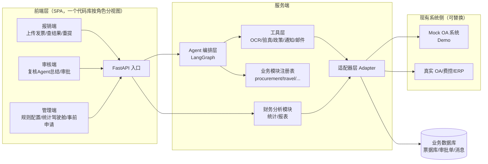
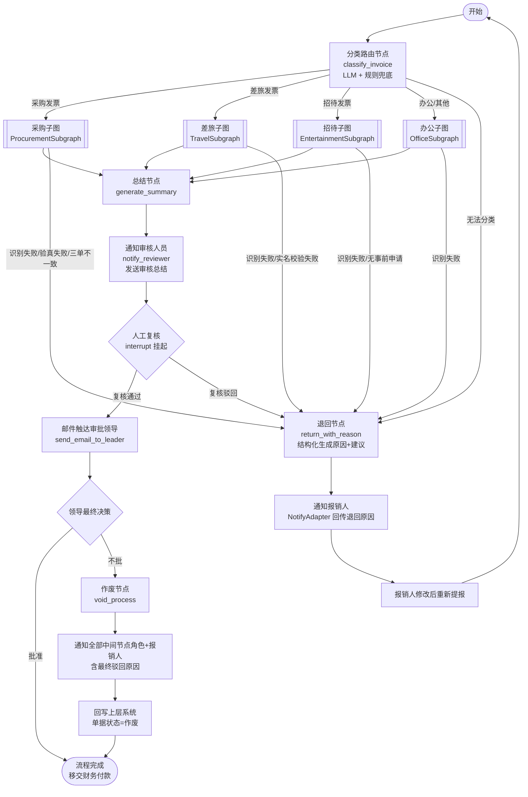
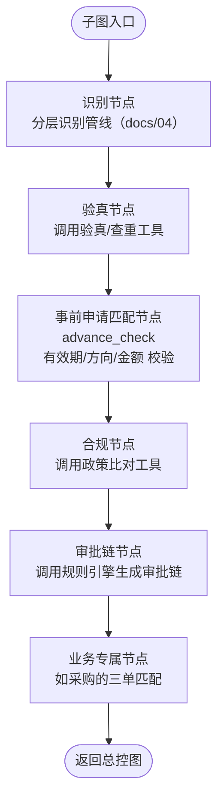
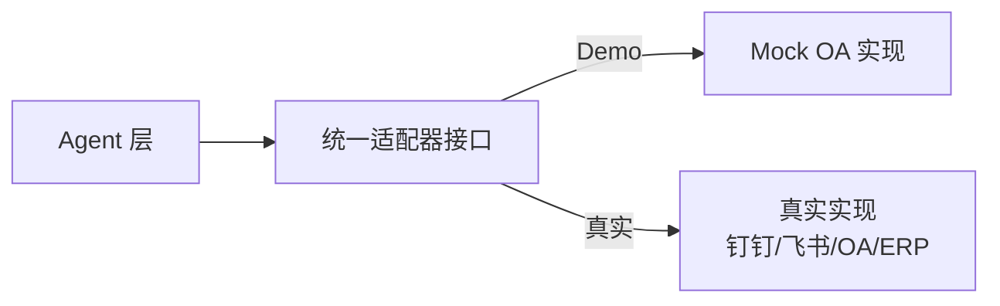

# 发票报销智能 Agent 系统 —— 项目整体架构

> 版本：v0.1 ｜ 定位：可复用于现有系统的 AI 报销 Agent 服务
> 面试方向：Agent 开发岗（LangChain / LangGraph 多 Agent 编排）
> **本文档只讲架构**（分层 / 图设计 / 模块化 / 适配器 / 工具层 / 技术栈 / 前端）；业务流程见《02》、RAG 见《03》、识别验真见《04》、面试叙事见《05》、开发 Bug 见《07》、代码规范见 AGENTS.md，待办路线见 README Roadmap。

---

## 📍 当前进度（2026-09-01）

| 设计项 | 状态 |
|---|---|
| 主线闭环（识别→验真→查重→合规→审批链→总结→人工复核） | ✅ 已实现（差旅全链路可跑通） |
| 多业务子图（差旅已实现；办公/招待/采购注册表占位） | 🟡 差旅已实现，其余待开发（见 README 迭代待办） |
| 适配器层（存储 PgStorage+SQLite 替身 / 对象存储 MinIO+本地替身 / Mock OA） | ✅ 已实现，生产/测试双实现可切换 |
| 工具层 + LLM 理解类接线（分类/抽取/总结/合规） | ✅ 已实现（无 key 降级规则路径） |
| 异步任务层（Celery + Redis，P3） | ⬜ 规划中（#52；submissions 表/接口已就绪） |
| 统计驾驶舱 / 管理报表 | 🟡 前端多端已建，驾驶舱数据面待完善 |
| 发票报销时限（硬闸门：票种/抬头/超期直接退回）+ 高铁席别×职级合规（软闸门：标记+复核批注） | ✅ 已实现（#87/#85/#88，YAML 配置化） |
| 退回重提留痕（parent_request_id 关联原单） | ✅ 已实现（#89） |
| 审批 SLA（超时催办/升级） | ⬜ 规划中（#62） |

---

## 1. 项目定位

一句话描述：

> **「AI 报销 Agent 服务」：员工上传发票 → 多 Agent 自动完成 识别→验真→归类→合规→审批链生成→审核总结 → 通知审核人员复核 → 邮件触达审批领导。通过标准适配器接口，可直接复用到任意现有报销/OA 系统。**

设计目标：

| 目标 | 说明 |
|------|------|
| 多业务多图 | 发票先分类，**不同业务走不同 LangGraph 子图** |
| 模块化/插件化 | 每个业务 = 独立模块，注册表装配，新增业务不改主框架 |
| 可复用/可落地 | 适配器层抽象现有系统，Mock 可跑通 Demo |
| 人工兜底 | 关键决策点 Human-in-the-Loop（LangGraph `interrupt`） |

### 1.1 系统全景（主线 + 支线 + 属性增强）

业务看着多，但本质是**一条主线 + 两条支线 + 少量属性增强**：

**主线（核心闭环，一期全做）—— 一张发票的完整旅程：**

```
员工提交：发票 + 报销信息 + 选择业务类型 + 支付方式
  ↓
分类路由（classify）→ 业务子图（采购/差旅/招待/办公）
  ├─ 识别 → 验真/查重 → 事前申请匹配 → 合规 → 审批链生成
  ↓
审核总结 → 审核人员复核（interrupt）→ 邮件领导审批
  ├─ 通过 → 回写现有系统 + 进统计
  ├─ 退回 → 带原因通知报销人 → 修改重提
  └─ 否决 → 作废 + 通知全部审批链角色
```

**支线（支撑能力，一期全做）：**
- **事前申请单**：先申请后报销，锁方向/预算/有效期（规则与流程见《02》§12）
- **统计驾驶舱**：多角色视图（个人/审批人/财务/总经理，统计设计见《02》§11）

**属性增强（低成本，本质 = 提交字段 + 条件分支 + 统计维度）：**
- **支付方式**（对公 / 个人）：提交时选择，下游仅增加对公专属校验
- **预算管控**：科目额度字段 + 占用校验 + 执行率统计
- **税控抵扣**：验真时标记可抵税额 + 统计汇总

**明确不做（一期）：** ~~借款/备用金~~（适用场景有限）

---

## 2. 核心设计原则

1. **路由与业务分离**：顶层总控图只负责「分类 + 分发 + 汇总」，具体业务逻辑全部下沉到业务子图。
2. **业务子图同构**：所有业务子图遵循统一模板（识别 → 验真 → 合规 → 审批链），但**各自的节点实现、工具、政策规则不同**，可独立测试与扩展。
3. **规则可配置**：审批链规则、费用标准、抬头黑名单等全部外部配置（`policy/` 目录），不硬编码在 Agent 里。
4. **接口标准统一**：与现有系统的交互只依赖一组适配器接口，任何系统实现接口即可接入。
5. **审核结果双通道触达**：审核总结 → 审核人员（站内信/IM）；审批请求 → 领导（邮件）。
6. **业务异常闭环**：任何拒绝/退回都必须携带「原因 + 处理建议」回传上层系统与报销人，支持修改后重新提报，而不是静默失败 —— 让框架承载真实业务的异常复杂度。

---

## 3. 系统总体架构



**分层职责：**

| 层 | 组件 | 职责 |
|----|------|------|
| 前端层 | SPA（报销端/审核端/管理端） | 上传入口、复核审批交互、规则配置、统计驾驶舱 |
| 接入层 | FastAPI | 接收上传、鉴权、启动图执行、返回结果 |
| Agent 编排层 | LangGraph | 状态机、路由、子图调度、人工中断（HITL） |
| 工具层 | Tools | 发票识别、验真、政策比对、通知、邮件 |
| 业务模块层 | 业务子图注册表 | 各业务专属的图 + 政策规则 + 工具绑定 |
| 适配器层 | Adapter | 与现有系统/外部服务的统一接口 |
| 财务分析层 | Analytics | 多维度统计、报表、预算执行率、税额汇总（**只读旁路**，不参与审核流） |
| 存储层 | DB | 票据去重库、报销单、审批链、通知记录 |

> 分析层是只读旁路：不侵入审核流，避免影响主流程性能与复杂度；预算管控、支付方式、税控等属性增强项通过扩展业务子图节点、提交字段与政策规则实现，遵循「插件化模块 + 配置驱动」原则，主框架不变。

---

## 4. LangGraph 图设计（核心）

### 4.1 顶层总控图（Router Graph）



**关键机制说明：**

- **`classify_invoice`**：LLM 抽取发票类型与业务类型，同时用规则（抬头/金额/发票代码前缀）兜底，保证路由不出错。
- **`interrupt()`（LangGraph HITL）**：子图跑完后挂起，等待审核人员人工复核 Agent 的总结，复核结果通过 `Command(resume=...)` 恢复执行。这是 LangGraph 的招牌能力，也是面试必讲点。
- **总控图状态**：跨子图共享一份全局状态，子图只修改自己负责的字段，避免污染。
- **流程生命周期（状态机）**：`in_review → approved / returned / voided`。中间环节可修复问题 → `returned`（退回重提）；审核人员复核驳回 → `returned`；**最终领导不批 → `voided`（作废）**：通知审批链全部角色并终止流程，原单据不再延续。状态机显式建模，是「业务语义进框架」的核心体现。

### 4.2 业务子图模板（Base Subgraph）

所有业务子图遵循同一骨架，**但节点内实现各自不同**：



以采购为例，子图内部还会多出「三单匹配」「入库校验」等专属节点；差旅子图会多出「与出差申请核对日期」节点；所有子图共用「事前申请匹配」节点，校验报销是否命中有效的事前申请单（规则与流程详见《02》§12）。

### 4.3 全局状态定义（State Schema）

与真实代码 `app/core/state.py` 一致（节点单向写自己的字段，不越界）：

```python
class ReimbursementState(TypedDict, total=False):
    request_id: str                 # 报销单号；同时作为 LangGraph thread_id（中断恢复依据）
    invoice_input: dict             # 标准输入 DTO（发票文件 + 申报信息）
    business_type: str              # 分类结果：travel / procurement / ...

    invoice_data: dict              # 识别结构化票面（识别节点写）
    verification: dict              # 验真结果（验真节点写）
    advance_application: dict | None  # 命中的事前申请（匹配节点写）
    compliance_checks: list         # 合规检查项（合规节点写）
    policy_basis: list              # 制度条款依据（RAG 检索，合规节点写）
    approval_chain: list            # 计划审批链（审批链节点写）
    summary: str                    # Agent 审核总结（总结节点写）

    return_reason: dict             # 退回/作废原因 {category, message, suggestion}
    process_status: str             # 状态机：in_review / returned / approved / paid / voided
    current_step: str               # 当前挂起点：review / leader_decision / done
    decision: dict                  # HITL 决策（resume 传入）{action, comment, actor}
    approval_records: list          # 各级决策执行记录（审计留痕 / 驾驶舱数据源）
```

### 4.4 业务异常闭环设计原则

业务异常（明细见《02》§9）不是散落在流程文档里的描述，而是框架的**一等公民** —— 每个异常都有对应的图节点、状态写入、回传内容。设计原则：

- **可修复 vs 不可修复**：识别失败、抬头不符等「可修复」异常 → 带原因退回 + 允许重提；发票作废等「不可修复」异常 → 直接终止。
- **原因结构化**：`return_reason` 为 `{category, message, suggestion}`，由 Agent 生成，供上层系统直接展示/渲染，不依赖 LLM 自由文本。
- **退回 ≠ 作废**：`return_with_reason`（退回）与 `void_process`（作废）是两个不同出口。**退回** = 中间环节发现可修复问题，原因回传报销人，修改后重提，流程延续；**作废** = 审批走到最后一级被领导否决，整个流程终止，通知**审批链上全部角色**与报销人最终原因，单据状态置为 `voided`，如需再报须新建单据重新走全流程（全程可追溯）。
- **防死循环**：退回-重提闭环需设重提次数上限，超限转人工介入（后续增强项）。

---

## 5. 模块化设计（插件化业务模块 + 注册表）

### 5.1 模块接口规范

每个业务模块对外暴露统一接口，注册进 `registry`：

```python
class BusinessModule(ABC):
    name: str                                    # "procurement"
    invoice_types: list[str]                     # ["增值税专用发票", ...]
    def build_graph(self) -> CompiledGraph: ...  # 构建本业务子图
    def policy_rules(self) -> list[Rule]: ...    # 本业务政策规则
    def bind_tools(self) -> list[Tool]: ...      # 本业务绑定的工具
```

### 5.2 注册表（Registry）

```python
REGISTRY: dict[str, BusinessModule] = {
    "procurement":     ProcurementModule(),
    "travel":          TravelModule(),
    "entertainment":   EntertainmentModule(),
    "office":          OfficeModule(),
}

def route_to_module(business_type: str) -> BusinessModule:
    return REGISTRY[business_type]      # 顶层总控图按分类结果从这里取子图
```

**新增一个业务 = 新建一个模块类并注册**，主框架、总控图、适配器都不用改 —— 这就是「可复用、可落地」的落地方式。

---

## 6. 适配器层（对接现有系统）

目标：**让 Agent 服务不依赖任何具体系统**。所有对"外部系统"的调用都走抽象接口，Demo 用 Mock 实现，真实部署时替换为具体实现。



| 适配器接口 | 职责 | Mock 实现 | 真实实现示例 |
|-----------|------|-----------|-------------|
| `UserAdapter` | 员工/审批人信息、部门树 | 本地 JSON | OA 组织接口 |
| `InvoiceVerifyAdapter` | 发票验真 + 查重 | Mock 结果 | 国家税务查验 API / 第三方（见《04》§4） |
| `NotifyAdapter` | 发送总结给审核人员 | 打印/落库 | 钉钉/飞书 Webhook、站内信 |
| `EmailAdapter` | 发邮件给领导 | SMTP 本地 | 企业邮箱/邮件服务 |
| `StorageAdapter` | 报销单/票据持久化 | SQLite | PostgreSQL/现网 DB（生产架构见《06》规划） |

> 面试加分：说明这套适配器 = **依赖倒置**，让"AI 服务"与"业务系统"解耦，才能做到「打包复用到现有系统」。

---

## 7. 工具层（Agent 调用的工具清单）

| 工具 | 作用 | 技术实现 |
|------|------|---------|
| `ocr_tool` | 发票 → 结构化字段 | 按票据形态分层：数电票XML解析 / PaddleOCR+LLM 抽取 / 多模态VLM（见《04-发票识别与验真设计》）|
| `verify_tool` | 真伪 + 查重（票据去重库） | 税务接口 + 本地票据库 |
| `advance_tool` | 查询/校验事前申请单（有效期/方向/金额） | AdvanceApplication 存储 |
| `policy_tool` | 查询费用标准/政策规则 | 规则文件 + 规则引擎 |
| `approval_chain_tool` | 按规则生成审批链 | 配置表驱动（金额×类型×部门） |
| `notify_tool` | 发审核总结给审核人员 | NotifyAdapter |
| `email_tool` | 发审批邮件给领导 | EmailAdapter |

**Agent 与工具的交互方式**：子图节点内用 LangChain 的 tool-calling（`bind_tools`），让 LLM 决定调用哪些工具、传什么参数，结果回填状态。规则确定的部分（如审批链计算）走确定性代码，**LLM 不直接算审批链**，避免幻觉。

---

## 8. 技术栈选型

| 领域 | 选型 | 说明 |
|------|------|------|
| 编排 | **LangGraph**（Python） | 状态机、子图、interrupt（HITL） |
| LLM 框架 | LangChain | 工具调用、Prompt 管理、链式能力 |
| LLM | GPT-4o / Claude / Qwen（可配置） | 多模型抽象，便于切换 |
| OCR | 数电票XML解析 / PaddleOCR / 多模态 LLM | 分层可插拔（见《04》） |
| API | FastAPI + Pydantic | 接口与状态校验 |
| 数据库 | SQLite（Demo）→ PostgreSQL（生产） | 票据去重库、报销单（数据模型见《06》规划） |
| 消息 | 钉钉/飞书 Webhook（抽象） | NotifyAdapter |
| 邮件 | smtplib / 企业邮箱 SMTP | EmailAdapter |
| 前端框架 | React + TypeScript + Vite | 一个 SPA，按角色分视图 |
| 前端组件 | Ant Design | 企业级表格/表单/图表，适配管理端/审核端 |
| 打包 | Docker + docker-compose | 一键部署 |
| 测试 | pytest | 单图/全链路测试 |

**目录结构（目标工程骨架）：**

```
flowinvoice/
├── docs/                         # 设计文档（架构 / 流程 / RAG / 识别验真 / 面试 / Bug / 规范）
├── frontend/                     # 前端 SPA（报销端/审核端/管理端）
├── app/
│   ├── main.py                   # FastAPI 入口
│   ├── api/                      # 路由：上传/查询/复核
│   ├── core/                     # 配置、State Schema
│   ├── graphs/
│   │   ├── router_graph.py       # 顶层总控图
│   │   ├── base_subgraph.py      # 业务子图基类
│   │   └── businesses/           # 各业务模块（插件）
│   │       ├── procurement/
│   │       ├── travel/
│   │       ├── entertainment/
│   │       └── office/
│   ├── tools/                    # Agent 工具集
│   ├── shared/                   # 跨业务共享能力（政策引擎 / 事前申请）
│   ├── adapters/                 # 适配器（Mock + 接口）
│   ├── policy/                   # 政策规则配置（YAML）
│   └── registry.py               # 业务模块注册表
├── tests/
└── requirements.txt
```

---

## 9. 前端设计（报销端 / 审核端 / 管理端）

一个 SPA 代码库，按角色拆三组视图，角色决定可见页面（对接 RBAC 权限）。

### 9.1 三端视图

| 端 | 面向角色 | 核心页面 |
|----|---------|---------|
| **报销端** | 员工/报销人 | 上传发票 + 报销信息表单、进度查看、退回原因、重提 |
| **审核端** | 审核人员、审批领导 | 待办列表、复核详情（Agent 总结/发票/审批链/风险）、通过/驳回/作废 |
| **管理端** | 财务、总经理、管理员 | 统计驾驶舱（多角色视图）、规则配置、事前申请管理 |

### 9.2 技术选型与工作量控制

- React + TypeScript + Vite + **Ant Design**（企业级表格/表单/图表开箱即用，管理/审核类界面 80% 工作量由组件库覆盖）。
- **控制工作量的关键**：三端是**同一代码库的视图分组**，不是三个独立工程；管理端尽量薄（驾驶舱优先，规则配置可用 YAML 编辑页代替复杂表单）。
- 后端 API 已有（FastAPI），前端纯消费，不新增业务逻辑。

---

## 10. 文档地图（各文档定位）

| 文档 | 只讲这一件事 |
|------|------------|
| **01 项目整体架构**（本文档） | 系统架构：分层 / 图设计 / 模块化 / 适配器 / 工具层 / 技术栈 / 前端 |
| **02 报销场景与业务流程** | 业务规则与流程：票种分类、六步流程、审批链、异常分支、统计、事前申请 |
| **03 报销制度研究与RAG设计** | 制度条款语料来源 + RAG 检索设计 |
| **04 发票识别与验真设计** | 按票据形态分层的识别管线 + 税局查验/电子签名验真 |
| **05 面试架构** | 面试叙事：一句话定位、高频考点映射、追问应对（独立于整体架构） |
| **06 数据模型设计** | 数据库 / 记忆设计 / 企业级生产架构（规划中） |
| **07 开发Bug总结** | 开发过程 Bug 复盘（现象→根因→修复→启示） |
| **AGENTS.md** | 代码规范：分层 / 复用 / 注释 / 扩展 + §13 代码简洁硬性规则 |

> 待办路线（LLM 接入、去硬编码、PgStorage、pgvector RAG 等）统一维护在 **README.md 的 Roadmap**，不散落于各文档。
