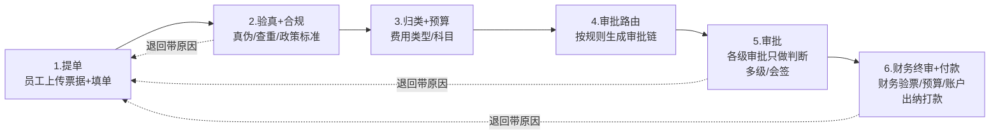
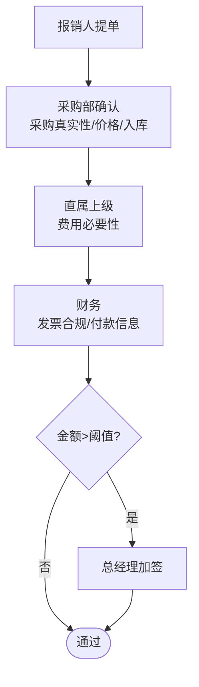

# 常见报销场景与业务流程说明

> 版本：v0.1 ｜ 对应《01-项目整体架构.md》中业务子图的场景定义
> 用途：梳理企业报销业务域，作为 Agent 业务流程与规则设计的依据

---

## 1. 报销业务概述

**报销**：员工因公消费（差旅、采购、招待、办公）先行垫付，凭票据向公司申请，公司审核后补还费用的过程。

核心链路：**消费 → 拿票 → 提单 → 审核 → 打款**，各环节有不同角色与规则把关。

**系统视角**：本系统覆盖「提单」之后到「打款」之前的审核与审批环节，通过 Agent 自动化其中的识别、验真、归类、合规、审批链生成，人工只保留最终决策。

---

## 2. 发票分类体系

发票按「税务类型」与「业务场景」两个维度分类，Agent 的 `classify_invoice` 节点据此路由：

### 2.1 按税务/票种维度

| 票种 | 特征 | 关键点 |
|------|------|--------|
| 增值税专用发票 | 含「购买方」「销售方」「税率」「税额」 | **可抵扣进项税**，采购类需三单匹配 |
| 增值税普通发票 | 无税额抵扣栏 | 不可抵扣 |
| 电子发票（全电票） | 数字形式，可重复打印 | **验真+查重是重点** |
| 火车票/机票 | 实名制行程凭证 | 需与出差申请核对 |
| 出租车/网约车行程单 | 出行凭证 | 注意日期与出发地合理性 |
| 餐饮/住宿票据 | 消费凭证 | 有费用标准上限 |
| 通行费/停车费/加油票 | 车辆相关 | 归入用车/差旅 |

### 2.2 按业务场景维度（本系统路由依据）

| 业务类型 | 对应票种 | 典型场景 | 特征 |
|---------|---------|---------|------|
| `procurement` 采购 | 增值税专票/普票 | 采购设备、物资、办公家具 | 涉及采购部 + 入库 + 可抵扣 |
| `travel` 差旅 | 火车票/机票/酒店/打车 | 出差往返、住宿 | 需关联出差申请，核对日期 |
| `entertainment` 招待 | 餐饮/服务 | 商务宴请客户 | 需事前申请 + 标准上限 |
| `office` 办公 | 办公用品/低值易耗 | 文具、耗材、日常杂费 | 金额小、频率高 |
| `transport` 交通 | 出租车/网约车/停车 | 市内通勤办事 | 归入差旅或单独核算（可并入 travel） |

> 分类规则：LLM 语义判断 + 规则兜底（抬头、金额、票种、报销事由关键词）。无法确定时走人工介入节点。

---

## 3. 通用报销流程（六步）



| 步骤 | 动作 | 人工/自动 | 本系统 Agent 承担 |
|------|------|----------|------------------|
| 1 提单 | 上传票据 + 填报销信息 | 人工 | — |
| 2 验真+合规 | 真伪、查重、抬头/日期/标准比对 | 传统财务手工 | ✅ `verify` / `compliance` 节点 |
| 3 归类+预算 | 判断费用类型与预算科目 | 人工判断 | ✅ `classify` 节点 |
| 4 审批路由 | 按规则拼审批链 | 制度文档人工记 | ✅ `approval_chain` 节点 |
| 5 审批 | 各级审批人复核、领导决策（只做判断，不碰资金） | 人工 | ⚠️ Agent 出总结，人做决策 |
| 6 财务终审+付款 | 财务付款前终审（发票/预算/账户）→ 出纳打款 → 入账留档 | 财务/出纳 | 本系统暂不覆盖 |

> 审批任一级被否决的后果：**中间环节否决 → 退回报销人修改重提**（流程延续）；**最后一级领导否决 → 整单作废**，通知全体审批链角色与报销人，原流程终止（详见 §9）。

---

## 4. 角色与职责

| 角色 | 职责 | 在流程中的位置 |
|------|------|---------------|
| 报销人（员工） | 上传票据、填单、说明用途 | 提单 |
| 直属上级 | 确认「这笔钱确实该花」 | 一级审批 |
| 部门负责人 | 确认部门预算与事项真实性 | 二级审批（中额） |
| 采购部 | 确认采购真实、价格合理、**货物已入库** | 采购会签 |
| 财务/报销专员 | 发票合规、预算、支付信息核验 | 终审 |
| 总经理/高层 | 大额决策 | 加签 |
| 出纳 | 打款 | 付款 |

> ⚠️ **关键边界：审批 ≠ 支付**
> 审批链上的人（直属上级、部门负责人、总经理）只做「这笔费用应不应该报销」的判断，**不直接触达资金、无打款权限**。
> **打款（支付）统一由财务部执行**：各级审批全部通过 → 单据进入财务 → 财务做付款前终审（发票合规、预算余额、收款账户）→ 出纳打款。
> 所以：**一级审核部门不能直接批准打款**。审批通过 ≠ 支付，它只代表「费用成立」，钱由财务统一支付。

---

## 5. 审批链规则（规则引擎配置）

审批链由「费用类型 × 金额 × 部门」动态生成，这是 Agent `approval_chain` 节点的数据来源。规则以配置文件维护（本系统 `app/policy/` 目录）。

### 5.1 金额阈值规则

| 金额区间 | 审批层级 |
|---------|---------|
| ≤ 500 | 直属上级 |
| 500 ~ 3000 | 直属上级 → 部门负责人 |
| 3000 ~ 10000 | 直属上级 → 部门负责人 → 财务 |
| > 10000 | 直属上级 → 部门负责人 → 财务 → 总经理 |

### 5.2 业务类型规则（含联合上报）

| 业务类型 | 金额区间 | 审批链 | 说明 |
|---------|---------|--------|------|
| 采购 | 任意 | **采购部确认 → 直属上级 → 财务** | 联合上报；专票需三单匹配 |
| 差旅 | ≤ 2000 | 直属上级 → 财务 | 需与出差申请核对 |
| 差旅 | > 2000 | 直属上级 → 部门负责人 → 财务 | 超标准部分特殊说明 |
| 招待 | ≤ 1000 | 直属上级 | 需附事前申请 |
| 招待 | > 1000 | 直属上级 → 部门负责人 → 总经理 | 事前申请 + 客户信息 |
| 办公 | ≤ 500 | 直属上级 | 小额高频 |
| 办公 | > 500 | 直属上级 → 部门负责人 | 预算占用校验 |

### 5.3 联合上报（会签）示意

**你提到的「采购发票由采购部和报销部联合上报」实现方式：**



> 采购部只确认「采购事项」，财务确认「发票与付款」，二者互不越权 —— 这就是联合审批的业务含义。
> 审批链中的「财务」= **财务付款前终审**（验发票/验预算/验收款账户）；真正把钱打出去的是**出纳**，在终审通过后执行。各级审批人均不具备打款权限。

---

## 6. 各业务场景详细流程

### 6.1 差旅报销

```
提报：火车票/机票 + 酒店发票 + 打车行程单 + 出差申请单
Agent 审核链：
  ① 识别：OCR 抽取各票据（车次/日期/酒店/金额）
  ② 验真：票据真伪 + 查重
  ③ 合规：
     - 抬头 = 公司全称
     - 日期是否在出差申请区间内
     - 住宿是否超标准上限
     - 机票/火车票实名信息 = 报销人
  ④ 审批链：直属上级 →（超标准加负责人）→ 财务
总结示例：
  ✅ 5张票据全部验真通过，无重复报销
  ⚠️ 酒店超标准 120 元/晚，已提示
  审批链：直属上级 → 财务
```

### 6.2 采购报销（联合上报）

```
提报：增值税专用发票 + 采购申请单 + 入库单/验收单
Agent 审核链：
  ① 识别：OCR 抽取发票（购买方/销售方/税额/金额）
  ② 验真：真伪 + 查重 + 抵扣资格
  ③ 合规：
     - 抬头 = 公司全称
     - 专票信息完整（税号/银行账号）
     - 金额与采购申请一致
  ④ 三单匹配：发票 vs 入库单 vs 验收单 一致性
  ⑤ 审批链：采购部确认 → 直属上级 → 财务（联合上报）
总结示例：
  ✅ 专票验真通过，可抵扣税额 ¥3,450.00
  ✅ 三单匹配一致
  审批链：采购部 → 直属上级 → 财务（联合审批）
```

> **支付方式（提交时申报人选择，分层即可）**：① 员工垫付报销 —— 财务补钱给员工；② 对公付款 —— 财务直接付供应商，Agent 额外校验供应商信息/合同/三单匹配。核心审核链两种方式完全共用，对公只是**多几个校验点 + 换支付目标**，不是独立模块。

### 6.3 业务招待报销

```
提报：餐饮发票 + 招待事前申请（客户名称/人数/标准）
Agent 审核链：
  ① 识别 + 验真 + 查重
  ② 合规：
     - 是否有对应事前申请
     - 人均消费是否超标准
     - 日期是否在申请有效期
  ③ 审批链：直属上级 →（超限加签负责人/总经理）
总结示例：
  ⚠️ 未找到对应招待事前申请，需人工确认
  ⚠️ 人均 ¥350，超标准 ¥80
  审批链：直属上级 → 部门负责人（待人工核实）
```

### 6.4 办公用品/日常费用

```
提报：普通发票 + 用途说明
Agent 审核链：
  ① 识别 + 验真 + 查重
  ② 合规：抬头、金额、是否在部门预算内
  ③ 审批链：直属上级 →（超 500 加部门负责人）
总结示例：
  ✅ 小额办公费用，验真通过
  审批链：直属上级
```

---

## 7. 关键控制点（Agent 审核必须覆盖）

这些是企业报销的「红线」，也是 Agent 相对人工的核心价值：

| # | 控制点 | 检查内容 | 对应节点 |
|---|--------|---------|---------|
| 1 | 发票查重 | 同一发票是否已报销过（电子票可重复打印） | `verify` |
| 2 | 发票验真 | 真伪、税号、是否已作废 | `verify` |
| 3 | 抬头校验 | 购买方名称 = 公司全称 | `compliance` |
| 4 | 日期合理性 | 发票日期 vs 报销日期 vs 出差申请日期 | `compliance` |
| 5 | 标准上限 | 住宿/餐费/交通是否符合政策标准 | `compliance` |
| 6 | 三单匹配 | 采购类：发票+入库单+验收单一致 | 采购子图专属 |
| 7 | 预算占用 | 是否超部门/项目预算 | `compliance` |
| 8 | 抵扣资格 | 专票是否满足进项税抵扣条件 | 采购子图专属 |
| 9 | 审批链完整 | 生成的审批链是否覆盖所需角色（含联合上报） | `approval_chain` |
| 10 | 事前申请匹配 | 是否命中有效事前申请单 | `advance_check` |
| 11 | 申请单有效期 | `valid_until >= 报销日期` | `advance_check` |
| 12 | 方向/金额匹配 | 方向一致、金额在预估容差内 | `advance_check` |

---

## 8. 场景与 Agent 映射

| 业务场景 | 对应子图 | 专属工具/节点 | 关键差异 |
|---------|---------|--------------|---------|
| 采购 | `procurement` | 三单匹配、抵扣校验 | 联合上报 + 入库 |
| 差旅 | `travel` | 出差申请核对、实名校验 | 日期区间 + 标准上限 |
| 招待 | `entertainment` | 事前申请匹配、人均标准 | 事前审批 + 客户信息 |
| 办公 | `office` | 预算占用校验 | 小额高频、规则简单 |

> 同构子图模板（识别→验真→合规→审批链）+ 各自专属节点，既统一又隔离 —— 对应架构文档中的 Base Subgraph 设计。

---

## 9. 常见异常分支（Agent 需处理）

| 异常 | Agent 行为 | 退回原因（回传报销人） | 报销人处理 |
|------|-----------|----------------------|-----------|
| 发票无法识别/模糊 | 阻断，生成退回原因 | 「图片模糊，识别失败」 | 重新清晰拍照上传 |
| 验真失败/已作废 | 阻断，生成退回原因 | 「验真失败：发票已作废」 | 更换有效票据 |
| 重复报销 | 阻断，生成退回原因 | 「重复报销：该票已于 #xxx 报销」 | 核对是否误传 |
| 抬头不符 | 标记风险，转人工 | 「抬头与公司全称不符」 | 联系财务确认补正 |
| 超标准 | 不阻断，加风险标记 | 「超标准 ¥80，需特殊审批」 | 补充说明后继续 |
| 三单不一致 | 阻断，转采购部确认 | 「三单不一致：入库数量不符」 | 与采购部核实修正 |
| 无法分类 | 阻断，生成退回原因 | 「无法识别业务类型」 | 补充用途说明后重提 |
| 缺少事前申请 | 阻断，生成退回原因 | 「缺少事前申请：请先提交事前申请」 | 先创建事前申请单 |
| 事前申请已过期 | 阻断，生成退回原因 | 「事前申请已过期，请重新提交申请」 | 重新提交事前申请 |
| 方向/金额超预估 | 标记超限，需特殊审批 | 「报销金额超出预估 20%」 | 补充说明，走特殊审批 |
| 最终领导不批 | 作废节点终止整个流程 | 「审核未通过：……」 | 全员知悉，单据作废，需新建单据重走 |

> **退回 ≠ 作废（两条业务闭环）**：
> - **退回**：中间环节发现**可修复**问题 → Agent 结构化生成原因（分类+说明+建议）回传报销人 → 修改后重提（次数设上限，防死循环）。流程延续。
> - **作废**：审批走到**最后一级被领导否决** → 整个业务流程作废。`void_process` 节点通知**审批链上全部角色**（直属上级/部门负责人/采购部/财务/审核人员）与报销人，告知最终驳回原因；单据状态置为「作废」，原流程终止。如需再报须**新建单据重新走全流程**，保证全程可追溯。

---

## 10. 参考：主流费控系统的通用流程

钉钉/飞书/每刻/汇联易等成熟费控系统共通的流程骨架：

```
发票拍照/上传 → 自动识别归档 → 税务验真/查重
→ 费用类型自动归类 → 政策规则自动校验
→ 审批流自动路由 → 审批 → 出纳打款
→ 影像归档 + 凭证自动生成 → 可审计追溯
```

本系统采用同一骨架，差异点在于：**用 LangGraph 多 Agent 编排替代传统硬编码规则引擎**，识别/归类/总结由 LLM 承担，审批链与验真等确定性操作仍由规则与工具承担 —— 兼具智能与可信。

---

## 11. 统计分析与多角色视图

多层审批设计的价值不止于自动化：审批链执行记录沉淀下来，让**不同角色都能从各自视角掌握报销情况** —— 财务看清钱流向、总经理把控全局，即使大部分单据并不经过总经理审批。

### 11.1 统计维度（通用）

| 维度 | 统计口径 | 示例 |
|------|---------|------|
| 业务方向 | 采购/差旅/招待/办公 金额与占比 | 采购 ¥520k 占 38% |
| 部门 | 各部门报销额排行 | 研发 ¥230k / 市场 ¥120k |
| 费用类型 | 住宿/交通/餐饮/办公 细分 | 差旅住宿 ¥15k |
| 时间 | 月/季/年汇总与环比 | 8 月报销 ¥860k，环比 +12% |
| 审批状态 | 待审/已批/退回/作废 单量与金额 | 作废率 2.3% |
| 预算执行 | 科目预算 vs 实际占用 | 招待费预算已用 80% |
| 税额 | 专票可抵进项税合计 | 可抵扣 ¥45.6k |

### 11.2 多角色统计视图

| 角色 | 统计视图 | 用途 |
|------|---------|------|
| 报销人 | 我的报销单/状态/金额 | 个人进度与历史 |
| 直属上级 | 待我审批 / 我审批过的单 | 审批效率 |
| 财务部 | 账务明细、预算执行、税额抵扣、部门成本 | 账务处理与税务 |
| 总经理/管理层 | **管理驾驶舱**（见下表） | **整体业务把控** |

**总经理管理驾驶舱指标**（不管审批是否经过总经理，都能看全局）：

| 指标 | 说明 |
|------|------|
| 审批漏斗/成功率 | 提交 → 审核通过 → 终审完成 转化率；退回率、作废率 |
| 报销整体规模 | 总金额、月度趋势、按方向/部门分布 |
| 审批链健康度 | 各级审批耗时、积压、大额决策人 |
| 异常预警 | 高频退回原因、风险标记汇总、大额异常 |
| 合规率 | 查重/抬头/标准/三单匹配 命中与拦截情况 |

> 数据基础：审批链执行记录（各级决策人/时间/结果）随审核落库，才支撑得起「不经过我也能管全局」的管理驾驶舱。

### 11.3 典型报表

- **月度报销汇总表**：按方向/部门汇总金额与单量
- **部门费用排行**：成本归集与异常波动
- **预算执行率表**：超预算预警
- **税额抵扣汇总**：供税务申报
- **退回/作废分析**：高频退回原因（驱动流程改进）
- **管理层驾驶舱**：审批漏斗、整体规模、审批链健康度、异常预警（供总经理/管理层把控业务）

### 11.4 与系统的关系

- 数据来源：报销单记录（含最终状态 `approved / returned / voided`、金额、业务方向、税额）+ **审批链执行记录**（各级决策人/时间/结果），由 StorageAdapter 持久化。
- 实现方式：报表查询 Agent（自然语言 → analytics 工具 → 报表 + 解读）或标准报表 API + 定时任务。
- 财务只读访问，不参与审核流；统计结果反哺预算管控与风控规则（落地路线见 README Roadmap）。

---

## 12. 事前申请（先申请、后报销）

### 12.1 为什么要有事前申请

差旅、招待、采购都是「**先申请 → 后消费 → 再报销**」。事前申请单的作用：

- **锁方向**：明确这笔钱属于哪个报销方向/费用类型；
- **锁预算**：记录大致金额，占用预估额度；
- **限时效**：申请单有**过期时间**，过期作废、不可用于报销；
- **可审计**：消费与申请的对应关系全程可追溯。

### 12.2 事前申请单要素

| 字段 | 说明 | 示例 |
|------|------|------|
| 申请单号 | 唯一标识，报销时关联 | PA-202608-001 |
| 申请人/部门 | 发起人 | 张三 / 采购部 |
| **报销方向** | 采购/差旅/招待/办公 | procurement |
| 费用类型 | 更细的科目 | 住宿 / 物资采购 |
| **大致金额** | 预估额度 | ¥50,000 |
| 事由 | 说明 | 采购研发测试设备 |
| **有效期** | 过期时间，过期不可报销 | 2026-09-15 前有效 |
| 状态 | active / used / expired | active |

### 12.3 生命周期

```
创建 → 事前审批（直属上级 → 部门负责人）→ active
  → 报销命中 → used（核销）
  → 到期未用 → expired（定时任务标记，不可再用）
```

### 12.4 报销时的匹配规则（Agent `advance_check` 节点）

| 校验 | 规则 | 不通过 → |
|------|------|---------|
| 存在性 | 必须命中有效申请单（差旅/招待/采购强制，办公可免） | 退回「缺少事前申请」 |
| **有效期** | `valid_until >= 报销日期` | 退回「事前申请已过期」 |
| **方向** | 申请单方向 == 报销业务类型 | 退回「报销方向与事前申请不符」 |
| 金额 | 报销金额 ≤ 预估 ×（1+容差 20%） | 标记超限 → 特殊审批 |

### 12.5 各业务的强制程度与有效期

| 业务 | 是否强制事前申请 | 建议有效期 |
|------|-----------------|-----------|
| 差旅 | 是（出差申请） | 出差日期区间 |
| 招待 | 是（招待申请） | 7 天 |
| 采购 | 是（采购申请/订单） | 按采购周期 |
| 办公 | 否（小额高频） | — |
