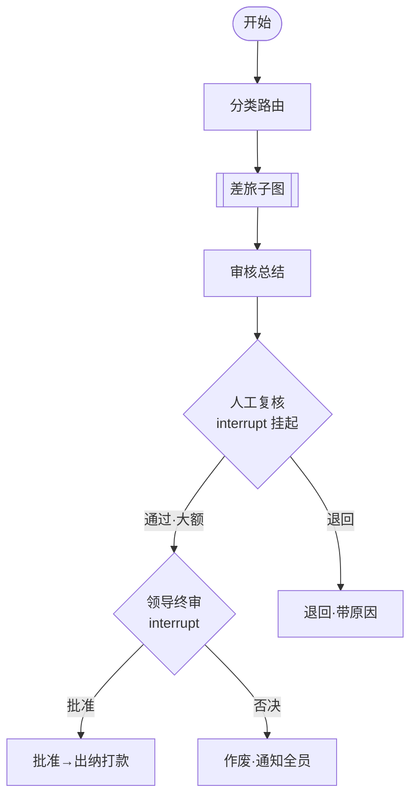

# 面试架构（FlowInvoice · 项目叙事框架）

> 版本：v0.1 ｜ 定位：**面试版「怎么讲这个项目」**——与 docs/01（整体架构设计）**分离**，只解决一个问题：如何把 FlowInvoice 讲成 Agent 应用开发岗面试官想听的故事
> 依据：2026 秋招大模型 Agent 应用开发岗 JD + 高频面经（LangChain/LangGraph、状态机、HITL、工具调用、RAG、异常兜底、权限、可观测、幻觉控制）
> 配套：docs/01（架构事实）/ 02（流程）/ 03（RAG）/ 04（识别验真）；本文所有「证据」均可指向具体代码

---

## 1. 项目一句话定位（开场 10 秒）

> **一个「多 Agent 报销审核编排系统」**：员工上传发票，Agent 自动完成识别 / 验真 / 分类 / 合规 / 审批链 / 总结，人工只留最终决策。
> 用 **LangGraph 状态机**把流程画成图、`interrupt` 做人工兜底（HITL）；**工具与规则做确定性兜底**——LLM 只干理解类的活。

## 2. 叙事主线（STAR，60–90 秒）

| | 内容 |
|---|---|
| **S 情境** | 企业报销审核靠人工：发票格式杂（数电票/纸票/行程单）、制度条款多、审批链要留痕、**钱的事不能错** |
| **T 任务** | 做一套可复用到现有报销/OA 系统的 AI 审核层：识别→验真→合规→审批链→总结→人工复核 |
| **A 行动** | LangGraph 总控图 + 业务子图注册表；`interrupt` HITL；验真/审批链等确定性操作走工具与规则，LLM 只做分类/抽取/总结/合规理解；退回/作废双闭环；决策记录落库 |
| **R 结果** | 差旅最小闭环可演示（上传→复核→大额终审→出纳打款）；32 个单测+集成测试全绿；适配器 Mock 可跑、真实系统即插即用 |

## 3. 分层讲述框架（由浅入深）

### L2 · 30 秒——系统全景 + 为什么用图

> 一句话：**「这不是一条 A→B→C 的 Chain，是带分支、回环、人工挂起的状态机图」**——差旅有退回重提环，大额有领导终审分支，这正是 Chain 做不到、LangGraph 才选它的原因。

### L3 · 2 分钟——三个关键设计决策与 Trade-off

| 决策 | 选了什么 | 放弃什么 | 为什么 |
|------|---------|---------|--------|
| **多图 vs 单图** | 每个业务一个子图 + 注册表装配 | 单一巨型图 | 规则隔离（差旅查日期、采购验三单）、独立演进；代价是框架多点装配代码 |
| **工具/规则 vs LLM** | 验真/审批链/查重走确定性工具；LLM 只做理解 | 全流程 LLM 判断 | 钱和审计不能有幻觉；可复现可追溯 |
| **HITL vs 全自动** | 复核/终审两处 `interrupt` 挂起 | 全自动审批 | 审批必须人兜底；人工只占两个决策点，不抢 Agent 的活 |

## 4. 高频考点 ↔ 本项目映射表（核心）

| 高频考点 | 本项目实现（证据） | 一句话回答 |
|---------|------------------|-----------|
| **LangGraph vs LangChain**（必考） | `StateGraph` + 4 条条件边 + 业务子图（`app/graphs/router_graph.py`） | Chain 是线性 A→B→C；LangGraph 是**状态机图**——节点可条件分支、循环、HITL 挂起，审批这种带分支回环的流程必须用图 |
| **状态机存储与流转** | `ReimbursementState`（TypedDict）+ `process_status`（in_review/returned/approved/voided）+ `MemorySaver`（`state.py`/`router_graph.py`） | 状态存 checkpointer，节点单向写自己的字段；跨调用靠 `request_id` 即 thread_id 恢复 |
| **Human-in-the-Loop** | `wait_reviewer`/`wait_leader` 用 `interrupt()` 挂起、`Command(resume=...)` 恢复 | 关键决策点（人工复核/领导终审）挂起等人工，恢复后条件边路由——审批必须人兜底 |
| **Agent vs Workflow 怎么选** | 本项目 = **受约束 Workflow + LLM 决策点**：主干确定性，LLM 只做分类/抽取/总结/合规理解 | 固定流程用 Workflow 保可控可审计，把理解类决策点交给 LLM——**不为用 Agent 而 Agent** |
| **工具调用 vs 纯 LLM 判断** | 验真（`MockVerifyProvider`）、事前申请匹配（`AdvanceTool`）、审批链（YAML 规则）全走工具 | LLM 只做理解/生成；确定性、可审计操作走工具与规则，杜绝幻觉 |
| **RAG 混合检索** | `PolicyIndex` BM25 检索制度条款 → `policy_basis` 条款引用（docs/03 规划 bge-m3 向量后端） | 精确数值（金额/阈值）走 BM25，语义条款走向量召回 + rerank，混合互补 |
| **异常兜底 / 重试 / 降级** | 退回-重提双闭环 + 结构化原因回传（`return_node`/`void_node`） | 可修复异常带原因退回重提，不可修复作废终止；重提防死循环上限为后续增强项（未实现） |
| **权限管控** | 「角色 × 当前步骤」鉴权，越权 403/400（测试含越权用例） | 每个动作按角色×步骤校验，最小权限，敏感操作只留给对应角色 |
| **可观测 / 审计** | `approval_records` 决策留痕落库 → 列表/驾驶舱数据源（`router_graph.py` `_record`） | 各级审批决策人/时间/结果落库，自动化之外沉淀治理数据 |
| **幻觉控制** | 结构化输出（验真/审批链不靠 LLM）+ 政策依据条款引用 + 规则兜底 | 确定性兜底 + 引用溯源 + 结构化约束，不给 LLM 幻觉空间 |

## 5. 面试官会怎么追问 → 用项目证据怎么答

| 追问 | 项目证据 | 怎么答 |
|------|---------|--------|
| **状态放哪？怎么跨调用恢复？** | `MemorySaver` checkpointer + `request_id` 当 thread_id | 挂起后进程重来也不丢状态，`Command(resume=...)` 从断点续跑 |
| **检索不准 / 召回错怎么办？** | BM25 词法 + 条款级切分 + 退回带 `policy_basis` 引用 | 规则精确项不靠向量；语义条款混合检索 + rerank；结论可溯源到条款号 |
| **为什么不用纯 Agent / ReAct？** | 主干是 Workflow，LLM 只在 4 个理解点介入 | 审批是可审计的固定流程，全 ReAct 自由决策风险不可控 |
| **跑偏 / 死循环怎么防？** | 状态机显式建模 + 退回/作废两个出口 | 每个出口都带原因回传，不静默失败；上限防死循环是设计项（诚实标注未落地） |
| **权限怎么做？** | 角色 × 步骤鉴权 | 列表接口按角色过滤、动作按当前步骤校验，越权直接 403 |
| **成本 / 延迟？** | 确定性步骤（验真/审批链）不走 LLM | 90% 流程零 token 消耗，LLM 只花在理解类决策上 |
| **怎么评估好坏？** | 32 个单测+集成测试；决策记录可回放 | 有回归测试守住规则；留痕数据可支撑离线评测与线上指标 |
| **哪些是框架自带的？哪些是你设计的？** | LangGraph 提供图/状态/HITL；分层识别、工具与规则分离、退回作废双闭环、适配器依赖倒置、审计留痕是**本项目设计** | 诚实分层：框架给骨架，业务语义与工程决策是本项目价值 |

## 6. 覆盖度评估：这个项目能对上多少高频考点

### 6.1 三档

| 档位 | 考点 | 证据 |
|------|------|------|
| ✅ **强覆盖** | LangGraph vs Chain、状态机、HITL、工具 vs LLM、多图编排、异常闭环、权限、审计、识别分层（贴合 2025 数电票数字化） | 都有真实代码/测试 |
| 🟡 **部分** | 幻觉检测/自纠正（有"规则兜底+引用"，**无显式检测节点**）、评估体系（有测试，**无离线评测集+线上灰度**）、RAG 混合检索（BM25 已跑，**向量后端未接**） | 方向对，深度差一步 |
| ❌ **缺口** | **Function Calling 实战循环**（`bind_tools` 有声明，未真正让 LLM 选工具）、**MCP/A2A 协议**、**记忆系统**（短/长期记忆未做） | 面试口头可讲，代码无 |

### 6.2 补缺口建议（按性价比排序）

| 优先级 | 补什么 | 怎么做 | 对上的考点 |
|---|---|---|---|
| **P0** | LLM 接入落地 | 把 recognize/summarize/classify/compliance 四处接线（无 key 降级模板） | Agent 岗门槛：真代码里有 LLM |
| **P0** | Function Calling 实战 | 一个节点真正 `bind_tools` 让 LLM 选工具、回填状态 | 「工具调用底层怎么跑」高频题 |
| **P1** | 幻觉检测 | 加一个「合规结论 vs 条款」一致性校验节点（简单规则即可） | 幻觉控制、自纠正闭环 |
| **P1** | 评估 | 加一个离线评测脚本（若干用例 + 通过率），说明怎么量化 Agent | 系统设计压轴题「怎么评估」 |
| **P2** | MCP | 把 notify/email 包成 MCP server 演示 | JD 里的 MCP 关键词 |
| **P2** | 记忆系统 | 本业务无对话场景，价值低——只口头讲「短期=上下文/长期=向量库」设计 | 记忆是区分度高的考点 |

## 7. 避坑（雷区）

1. **别只说「用了 LangGraph」**：必被追问为什么用图、状态怎么存、异常怎么兜——都能指到代码。
2. **别把框架能力当个人能力**：图/状态/`interrupt` 是 LangGraph 自带的；分层识别、工具与规则分离、双闭环、适配器倒置、审计留痕才是**你做的**。
3. **数据必须真实**：32 测试全绿、Demo 可跑是真数；**驾驶舱统计、重提防死循环上限是规划中，不是已上线**——被戳穿比答不出更伤。
4. **别背八股没落地**：每个考点都对应一个代码文件，面试时「讲结论 + 指证据」。

## 8. 真实可说的数据（截止 v0.1）

- `pytest`：**32 passed**（含越权 403/退回/作废/打款闭环用例）
- 差旅最小闭环：上传 → 识别 → 验真 → 事前申请匹配 → 合规（含 RAG 条款依据）→ 审批链 → 审核总结 → 人工复核 →（大额）领导终审 → 出纳打款
- 退回 / 作废双闭环，`return_reason` 结构化回传
- `approval_records` 决策留痕落库，列表/驾驶舱数据源已通
- 识别方案按 2025 数电票数字化分层（docs/04）：XML 解析 / PaddleOCR / 多模态 VLM / 文本票 LLM
